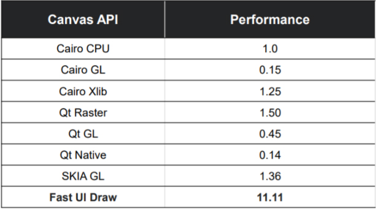
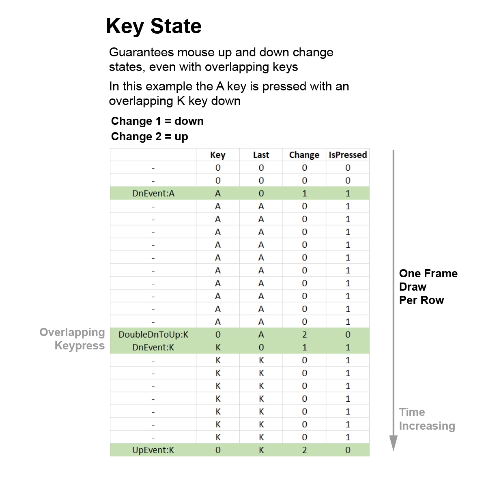

```
88888888888         db           ,ad8888ba,    
88                 d88b         d8"'    `"8b   
88                d8'`8b       d8'        `8b  
88aaaaa          d8'  `8b      88          88  
88"""""         d8YaaaaY8b     88          88  
88             d8""""""""8b    Y8,    "88,,8P  
88            d8'        `8b    Y8a.    Y88P   
88           d8'          `8b    `"Y8888Y"Y8a 
```

-----------------------------------------------------------------------
## **I hear Vulkan is awesome fast.  How fast is it?**

In our internal tests where we re-wrote parts of other applications the increase is 2X to 50X faster.  And as GPUs get faster the increase will grow. Vulkan is a cross-platform API made by the GPU hardware vendors (mostly: Intel, AMD and NVidea).  So it's going to be the fastest and lowest level cross-platform option.

-----------------------------------------------------------------------
## **Why is this project called GPU Script, but from what I see only runs C++?**

Our goal is to simplify using Vulkan to the point is easy to script. We are in the middle of a JavaScript layer and have our eye on Python. Once we have these pieces up and running and well tested we will bring them into the build.

-----------------------------------------------------------------------
## **I don't get what you mean by SUI and TUI?  What does this mean?  I don't see it in other Vulkan projects.**

These are terms that help simplify the 2 major types of drawing pipelines:

1. A complete DIY approach where everything from the UBO to the shader is all custom code. We call this SUI or "Shader UI".
 
2. A quick approach to get stuff on the screen fast using drawing libray calls.  Things like: AddRectangle, AddLine, AddText, ect.  You just make the stuff you need and don't worry about the low-level stuff below.  We call this TUI or "Triangle Based UI Draw Library".

    Often it's useful to use a mix of both, so we made a framework where it's easy to mix them together. We have a more detailed explanation of this topic [here](Tutorials_SUIvsTUI.md). 

-----------------------------------------------------------------------
## **Can I use this to do 2D?  To make a desktop app?**

Yes, this is a great platform for 2D.  The Vulkan community is primarily oriented to games and 3D projects.  We've extended that base and added lots of tools and functions to also excel at 2D projects.

-----------------------------------------------------------------------
## **Can I use this to do 3D?  To make a game?**

Yes, since Vulkan is designed for 3D you can.  Just use the SUI Shader UI to pass 3D verticies, vertex colors and uv coordinates.  

We have a [tutorial](Tutorials_ShaderToy_Particles.md) showing how to run ShaderToy examples here which would help get you started.

-----------------------------------------------------------------------
## **What is the relationship between this code and ImGUI?**

This code started as a app framework for running multiple Vulkan pipelines at the same time (the current Shader UI framework).  As we were planning out a 2D triangle submission UI we experiemented with ImGUI and thought it was great.  So we've included it in the app framework.

ImGUI tends to specialize in overlay UI that pops up and changes dynamically.  It's also really good for lists of different type of data.  So it's part of our app and we recommend using it for those cases.

Our team has been doing over 20 years of UI programming so we had quite a few app development cases (esp for business apps) that were outside of how ImGUI was working.  The major scenario is where UI panes are designed in Illustrator or Photoshop and you want to make a pixel accurate replica in the UI.  ImGUI, like QT tends to lean towards automated layout.

So we added our own general drawing and UI Library found in UILib.cpp for this type of scenario.

So we like ImGUI, and consider it a sister product we've embedded.  You may find both libraries useful for different scenarios and call both.  In our documentation "Triangle UI" refers to the combination of ImGUI & UILib.

We also have some additional UI technology that we're thinking about integrating that could widen the scope even more.

-----------------------------------------------------------------------
## **I'm not familiar with immediate mode UI coding, how can I learn it?**

Immediate Mode UI programming is amazing, this is a great intro about the concepts:
https://www.youtube.com/watch?v=Z1qyvQsjK5Y&t=2s

It also changes the way you think about events.  Instead of thinking about triggers when IO events happening, you use state (InputStateData, DisplayStateData) to read what has changed.

State is more powerful because it is syncronized with the Vulkan draw pipeline. A mouse event that triggered a single frame drawing reaction could easily happen mid-draw and be lost if there was no syncronization.

However there is a UI idea that we consider beyond Immediate Mode - that is the UI built by fragment shaders.  

Fragment shader UI has the potential to be mind-blowing fast because everything is calculated in parallel.  A good inspiration reference for this was made by Intel called [FastUIDraw](https://github.com/intel/fastuidraw).  Although it never took off the ideas are amazing and it was around 10X faster than any other UI approach:
https://github.com/intel/fastuidraw



So the UI framework in this Example App should be a great starting point for doing this type of experiment.  Of course the basics of displaying chunks of textures are covered in our docs, but there is another potential UI frontier beyond that.  You may also want to look at [Shadertoy](https://www.shadertoy.com/), they have many fascinating experiments with UI and shader generated text: 
https://www.shadertoy.com/

-----------------------------------------------------------------------
## **Can you explain more about using State instead of Events?**

Ok to start big picture you can use events if you choose, all the GLFW event callbacks are in: [c_Window.cpp](../Include/Core/c_Window.cpp)

However, this is not a great for mouse and keyboard events because they can easily occur in the middle of drawing and get trampled.  When using the UILib you don't even need to think of this, for example calling:

```cpp
UILib::DragStart()
```

will return true for only one frame of drawing.  So you can do something more complicated like begin a drag rectangle.  And you're guaranteed to be aligned with the Vulkan draw.

Under the hood this is happening both in `PipelineManager::UpdateUIInputs` and ImGui. They make sure that a change value is only for one frame.  Either carrying over last value (mouse change) or buffering values (key change) and filling state.



-----------------------------------------------------------------------
## **How does anti-aliasing work?**

For now the Triangle UI pipeline uses the AA features of ImGui.
This is done with a vertex color Anti-Alias Fringe.

**Note:** Anti-aliased filling requires points to be in clockwise order

-----------------------------------------------------------------------
## **Can I run this on iPhone / iPad?**

On iOS it works the same way as our Mac build.  Which is MoltenVK maps Vulkan into Metal calls: https://moltengl.com/moltenvk/

In fact the first 8 months of dev when this project started was on Mac.  Apple is currently accepting Vulkan-over-Metal apps in their store now as well: https://www.phoronix.com/scan.php?page=news_item&px=Apple-Lets-In-Updated-MVK-App

-----------------------------------------------------------------------
## **Can I run this on Android?**

Vulkan works really well on Android.  Both Google & Samsung are big supporters of Vulkan. We have only done some intial tests but here's the main site if you want to investigate porting it: https://developer.android.com/ndk/guides/graphics/index.html

-----------------------------------------------------------------------
## **Can I run this on the web?**

This code base currently can't run on the web.  But we are really interested in recent developments that could help do this. The biggest is ImGui is running in a browser: https://pbrfrat.com/post/imgui_in_browser.html

So it looks like this approach could be extended to our app framework. We have an interest in this but haven't done it yet.

We are also part of the WC3 GPU on the Web Community Group.  They are working towards an interface that will connect the web to "modern 3D graphics and computation capabilities".  From what we're seeing this will likely resemble Vulkan and would be a great target platform for GPU Script.

-----------------------------------------------------------------------
