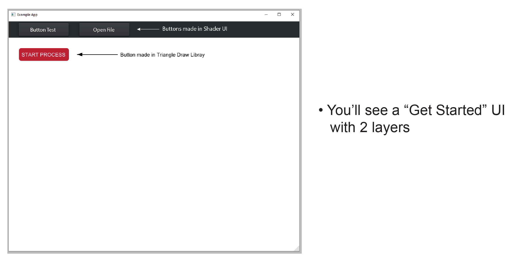
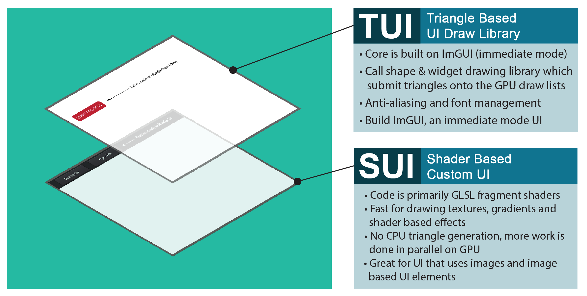
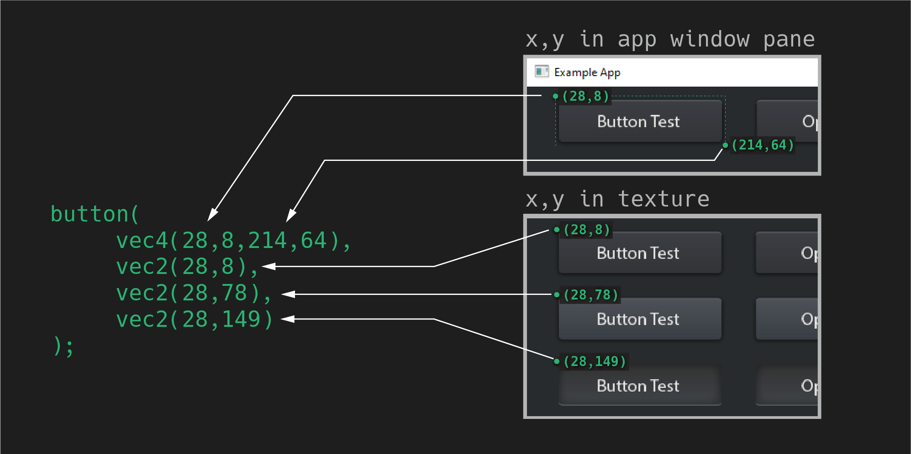
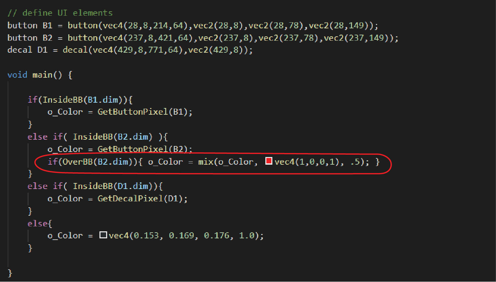
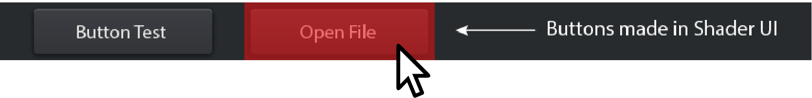
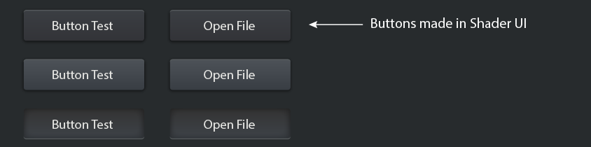
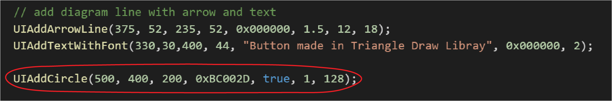
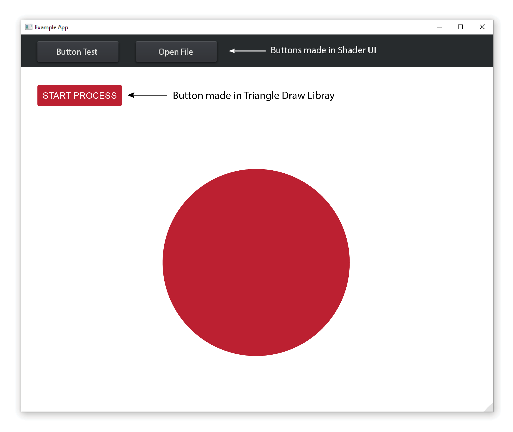
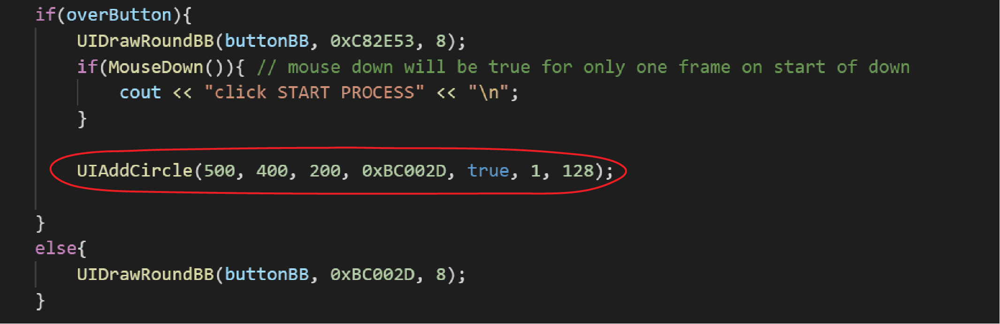

# **Get Started** - in under 10 minutes

## Outline

* [(1) Compile Build in VSCode](#1-compile-build-in-vscode)
* [Tune SUI - Shader Based UI](#SUI)
    * [Fragment Shader Code](#fragment-shader-code)
    * [Change Texture](#change-texture)
    * [SUI Change Clicking / Event Behavior](#sui-change-clicking--event-behavior)
* [Tune TUI - Triangle Based UI Draw Library](#TUI)
    * [C++ Example Code](#c-example-code)
    * [Experiment With Fonts](#experiment-with-fonts)

## **(1) Compile Build in VSCode**

* ### Run the executable in the **Build** folder



### There are 2 Vulkan Pipelines in this executable. <br> Both are drawn with a different UI strategy.



For a detailed comparision on these UI systems, check out the [SUI vs TUI tutorial](Tutorials_SUIvsTUI.md).

## <a id="SUI"></a>


### **Fragment Shader Code**
Stored in: [~/Shaders/SUI_Underlay_UI.frag](../Shaders/SUI_Underlay_UI.frag)

This code draws the texture on screen:
* Based on what pixel is evaluating
* Based on the mouse position and button up/down
* It’s mostly GPU with very little CPU, so it’s extremly fast

```glsl
// define UI elements
button B1 = button(vec4(28,8,214,64),vec2(28,8),vec2(28,78),vec2(28,149));
button B2 = button(vec4(237,8,421,64),vec2(237,8),vec2(237,78),vec2(237,149));
decal D1 = decal(vec4(429,8,771,64),vec2(429,8));

void main() {
    
    if(InsideBB(B1.dim)){
        o_Color = GetButtonPixel(B1);
    }
    else if( InsideBB(B2.dim) ){
        o_Color = GetButtonPixel(B2);
    }
    else if( InsideBB(D1.dim)){
        o_Color = GetDecalPixel(D1);
    }
    else{
        o_Color = vec4(0.153, 0.169, 0.176, 1.0);
    }

}
```

In this code, you are:
* Creating new UI elements, which are classes in this shader
* Setting the coordinates in window pane & texture space
* Checking if the bounding box:
    * Contains the pixel being currently evaluated by the fragment shader
    * Contains the mouse position

For example, button B1 cordinates are describing:



A simple 1 line modification would make the button 50% red on mouse over.

Add line:
```cpp
if(OverBB(B2.dim)){ o_Color = mix(o_Color, vec4(1,0,0,1), .5); }
```



Compile again.  Now when you mouse over it turns red.



### **Change Texture**

The texture used by the shader is stored here: [~Data/Example_ShaderUI_01.png](../Data/Example_ShaderUI_01.png)



You can also bring in another texture and change the path in code.

The connection is in: [~/Include/SUI_Panes/SUI_UnderlayUI.cpp](../Include/SUI_Panes/SUI_UnderlayUI.cpp)

You can swap out the image on this line:

```cpp
TexturePaths = {
    {"Data/Example_ShaderUI_01.png"}
};
```

When you swap out a texture, you’ll also need to let the [shader](../Shaders/SUI_Underlay_UI.frag) know the new dimensions.

Change these numbers to the width & height of your new texture:

```glsl
// --- SET CONSTANTS ---------------------------------------------------------
vec2 tSize = vec2(844, 210);  // it's important to set texture size because it's evaluated by percentage
```

You can also use more than 1 texture in your SUI Pane. See the [Ice Tutorial](Tutorials_ShaderToy_Ice.md#The-IceSUI-Constructor) for an example that uses 2 textures.


### SUI Change Clicking / Event Behavior

Stored in: [~/Include/SUI_Panes/SUI_UnderlayUI.cpp](../Include/SUI_Panes/SUI_UnderlayUI.cpp)

In this example, all drawing caluculations are in the GPU but it’s must faster and simpler to track the button click events in the CPU.

It’s not wasteful to have similar code in 2 places, in fact this is optimal in terms of GPU/CPU resources.

For code workflow, just get the drawing working on the GPU. Then copy and refactor the mouse in bounding box code here:

```cpp
void UnderlayUI::ProcessClicks(){
    
    if(Parent.GetInputState().Buttons[0].Change == 1){ 
        vec2 m = vec2(Parent.GetInputState().Position.X - X, Parent.GetInputState().Position.Y - Y);
        if(InsideBB(m, B1.dim)){
            cout << "clicked button 1:\n";
        }
        else if(InsideBB(m, B2.dim)){
            cout << "clicked button 2:\n";
            OpenFileDialogue();
        }

    }

}
```

Note the UI button coordinate code was copied over to the .h file: [~/Include/SUI_Panes/SUI_UnderlayUI.h](../Include/SUI_Panes/SUI_UnderlayUI.h)

```cpp
button B1 = {vec4(28,8,214,64),vec2(28,8),vec2(28,78),vec2(28,149)};
button B2 = {vec4(237,8,421,64),vec2(237,8),vec2(237,78),vec2(237,149)};
```

You need to tweak the syntax slightly when copying from shader language (GLSL) to regular C++.

## <a id="TUI"></a>


### C++ Example Code

Stored in: [~/Include/TUI_Panes/TUI_Example_LibraryUI.cpp](../Include/TUI_Panes/TUI_Example_LibraryUI.cpp)

```cpp
void ExampleLibraryUI::DrawUI(){
    
    // draw rounded red button 
    // we can use either the drawing functions like UIAddRoundRect or the bounding box drawing 
    // functions like UIDrawRoundBB.  In this case use the BB functions, then reuse them for mouse detection
    
    // given local window cordinates, this will return a global cord bounding box
    ImRect buttonBB = GetGlobalBB(35,30,172, 44);
    bool overButton = GetOverState(buttonBB);  // check if mouse is over the button

    // uses immediate mode UI - basically a big if tree that checks per-frame state instead of events
    if(overButton){
        UIDrawRoundBB(buttonBB, 0xC82E53, 8);
        if(MouseDown()){ // mouse down will be true for only one frame on start of down
            cout << "click START PROCESS" << "\n";
        }
    }
    else{
        UIDrawRoundBB(buttonBB, 0xBC002D, 8);
    }

    // add text on our button, specifying the second (larger size) Arial font imported
    UIAddTextWithFont(34,30,172, 44, "START PROCESS", 0xFFFFFF, 2, vec2(.5,.5));

    // add diagram line with arrow and text
    UIAddArrowLine(375, 52, 235, 52, 0x000000, 1.5, 12, 18);
    UIAddTextWithFont(330,30,400, 44, "Button made in Triangle Draw Libray", 0x000000, 2, vec2(.5,.5));

    

}
```

Add a circle with this line at the end:

```cpp
UIAddCircle(500, 400, 200, 0xBC002D, true, 1, 128);
```





We can make the circle draw only on button mouse over by moving it here:



Immediate Mode UI works like a huge `IF` statement.  It only draws if your UI state conditions are met.  Otherwise the code is never evaluated. This is a fast way to make UI code and very fast and minimal way to evaluate.

### Experiment With Fonts

Notice `AddTextWithFonts` has a second to last argument of: `inFontIndex`. In this code it is set at `2`.

```cpp
UIAddTextWithFont(34,30,172, 44, "START PROCESS", 0xFFFFFF, 2, vec2(.5,.5));
```

What this means we are selecting the 3rd font loaded.

You can set what fonts are loaded here: [~/Include/User/user_Layouts.cpp](../Include/User/user_Layouts.cpp)

```cpp
// Load fonts needed
fs::path font_path = AppData.RootPath / "Data/FreeSans.ttf";
io.Fonts->AddFontFromFileTTF(CONVERT_PATH(font_path), 15 );    // size 15
io.Fonts->AddFontFromFileTTF(CONVERT_PATH(font_path), 18 );    // size 18
io.Fonts->AddFontFromFileTTF(CONVERT_PATH(font_path), 20 );    // size 20
```

So we can see that font index `2` gives us 20 pixel size FreeSans. You can change the `inFontIndex` to switch in one of the smaller fonts.