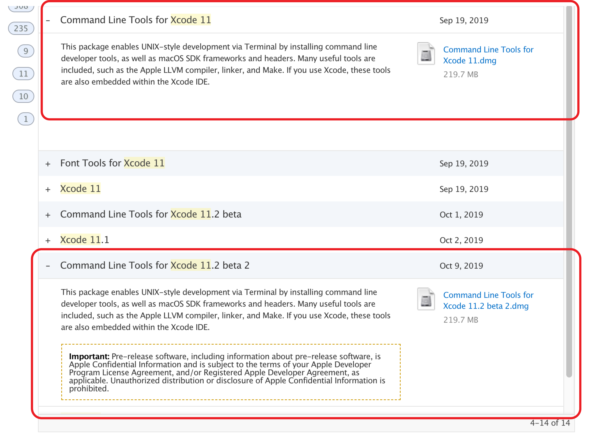
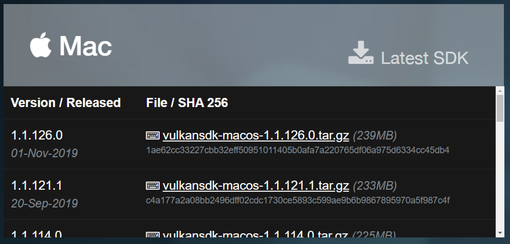
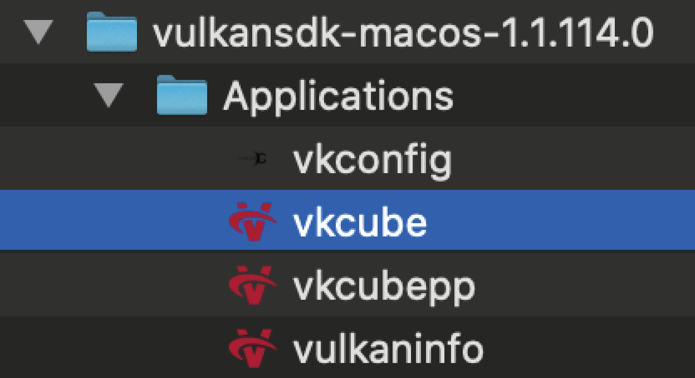
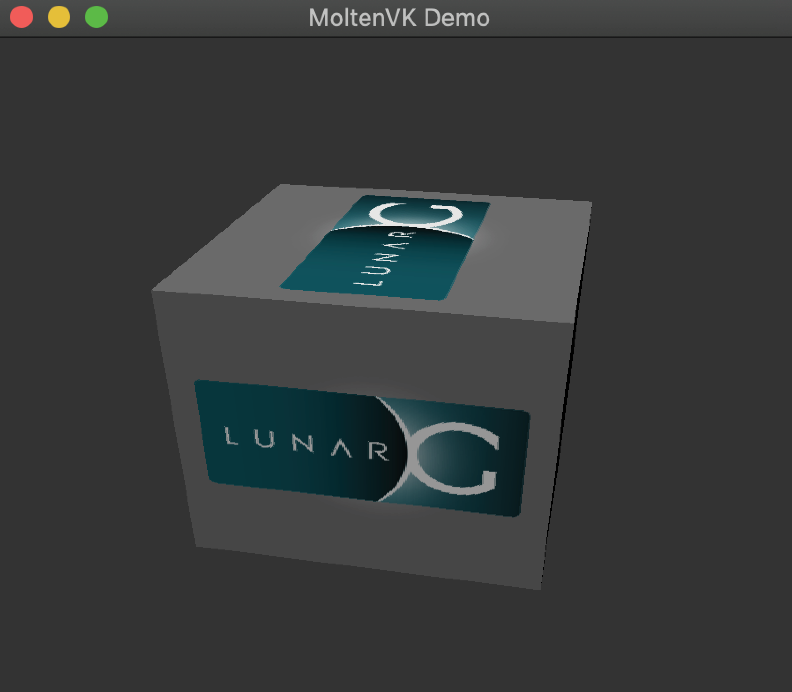
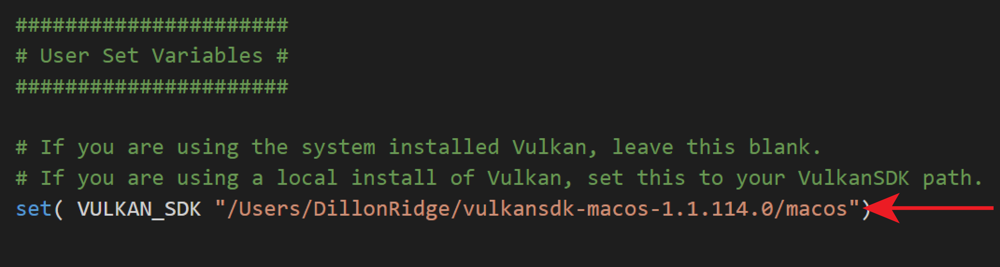
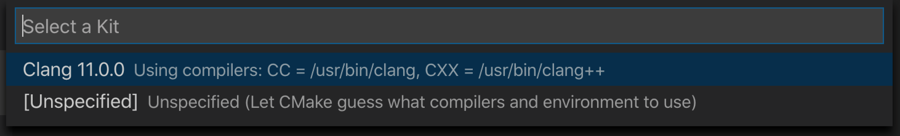
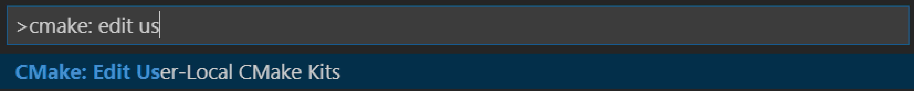
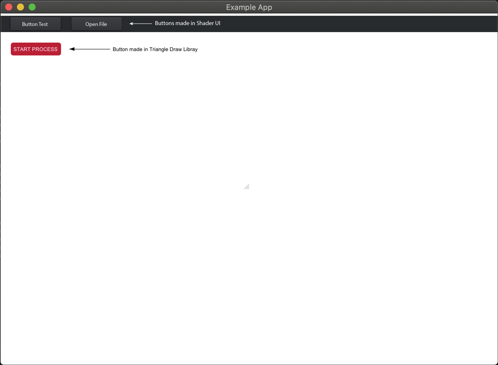

# **Install Notes for MacOS**

[(1) Set up Mac dev environment](#1-Set-up-Mac-dev-environment) <br>
[(2) Install dependencies](#2-Install-dependencies) <br>
[(3) Install Vulkan](#3-Install-Vulkan) <br>
[(4) Open the project in Visual Studio Code](#4-Open-the-project-in-Visual-Studio-Code) <br>
[(5) Compile the project](#5-Compile-the-project) <br>
[(6) Start experimenting with the API](#6-Start-experimenting-with-the-API)<br>
[Library Dependencies](#other-issues-you-may-come-across-could-be-related-to-dependencies-required-by-the-libraries-we-use-documentation-for-libararies-used-in-exampleapp-can-be-found-here)


**Note:** &emsp; Please check [GPU Script - Vulkan Version Compatibility](Vulkan_Compatibility.md) before downloading Vulkan.

-----

## **(1) Set up Mac dev environment**

### Install XCode and Command Line Tools from [https://developer.apple.com/](https://developer.apple.com/).




### Install Homebrew

```
/usr/bin/ruby -e "$(curl -fsSL https://raw.githubusercontent.com/Homebrew/install/master/install)"
```

### Install Visual Studio Code and set up extensions.

[https://code.visualstudio.com/](https://code.visualstudio.com/)

These extensions are useful for building the project:


-----

## **(2) Install dependencies**

### Using Homebrew, install CMake and Boost
```
brew install cmake
brew install boost --HEAD
```


*Note: These instructions assume you're using Apple's default, `Clang` as the compiler. If you want to use an alternative such as `gcc`, make sure Boost is also built with the same compiler. See documentation for the Homebrew `--cc` command [here](https://docs.brew.sh/Manpage#commands).* 

-----

## **(3) Install Vulkan**

*Please check [GPU Script - Vulkan Version Compatibility](Vulkan_Compatibility.md) before installing Vulkan.*

### Download the tarfile for the LunarG VulkanSDK from here:

[https://vulkan.lunarg.com/sdk/home](https://vulkan.lunarg.com/sdk/home)



### Unzip to a location of your choice.
You can test whether Vulkan works on your machine by running `vkcube` from the `Applications` folder. You should see a spinning LunarG cube.

<br>


### Add Vulkan to your path by editing `.bash_profile`.

Open your `.bash_profile` from the terminal. 

```
cd
open .bash_profile
```

*Note: MacOS Catalina is moving to the `zsh` terminal instead of `bash`. Catalina still has the `/bin/bash` binary on it. Make sure your terminal is set up using `bash`.*

Next, update your `.bash_profile` to include the following lines. Substitute in the path to your Vulkan folder.

```cpp
export VULKAN_SDK="<PATH TO SDK>/macOS"
export VK_LAYER_PATH="<PATH TO SDK>/macOS/etc/vulkan/explicit_layer.d" 
export DYLD_LIBRARY_PATH="<PATH TO SDK>/macOS/lib"
export VK_ICD_FILENAMES="<PATH TO SDK>/macOS/etc/vulkan/icd.d/MoltenVK_icd.json"
export PATH="$VULKAN_SDK/bin:$PATH"
```

### If you have multiple versions of Vulkan installed and want to specify which version to use for the project, update [CMakeLists.txt](../CMakeLists.txt) to specify the path to the VulkanSDK you want to use.



-----

## **(4) Open the project in Visual Studio Code**

### The first time you run Visual Studio Code on a C++ project, you may need to do some setup.

If you have installed the CMake Tools extension, you should see a blue bar at the bottom:


Click on `No Kit Selected`, and it should pop up a menu on the screen that lets you choose a compiler. Mac comes with `Clang`, so we use that to compile.



If there are no kits found, run CMake Tool's `Scan for Kits` command. To open the command palette in VS Code, press   `⌘ + SHIFT + P`.


If CMake Tools is unable to find Clang, run `CMake: Edit User-Local CMake Kits` from the command palette to open the `cmake-tools-kits.json` file. Paste in the following JSON to specify where Clang is located.
 


```
[
	{
		"name": "Clang 11.0.0",
		"compilers" : {
			"CC" : "/usr/bin/clang",
			"CXX" : "/usr/bin/clang++"
		}
	}
]
```

Once the kit has been found, the bottom blue bar should indicate it has found it.

 

-----

## **(5) Compile the project**

### Press `Build` to compile the project. 

You may see some warning during the compile process. As long as the executable builds, you can ignore the warnings.


### Open the ExampleApp executable and you should see:



-----

## **(6) Start experimenting with the API**

### Click here to [Get Started!](Get_Started.md)

-----

### Other issues you may come across could be related to dependencies required by the libraries we use. Documentation for libararies used in ExampleApp can be found here:

* [Vulkan](https://vulkan.lunarg.com/doc/sdk)
* [GLFW 3.3](https://www.glfw.org/)
* [GLM](https://glm.g-truc.net/0.9.9/index.html)
* [Dear ImGui](https://github.com/ocornut/imgui)
* [NativeFileDialog](https://github.com/mlabbe/nativefiledialog)
* [Intel](https://github.com/GameTechDev/PracticalVulkan)
