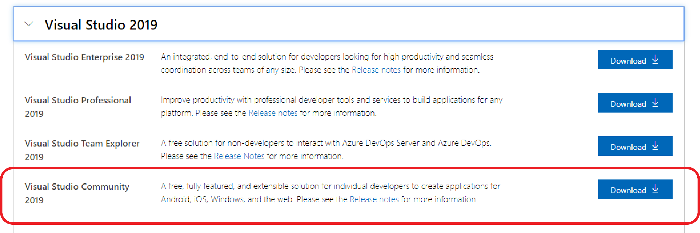
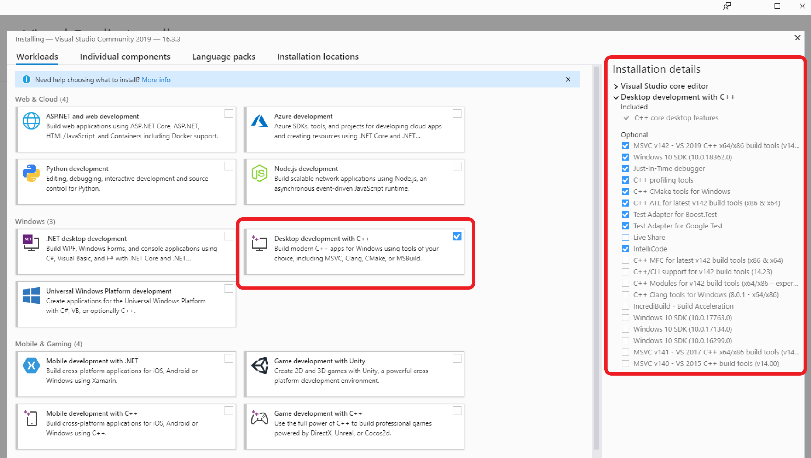
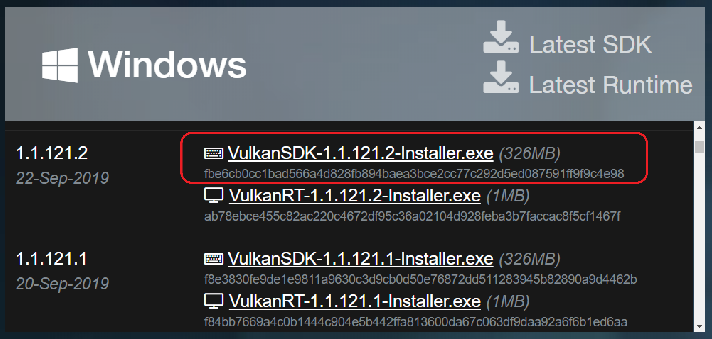
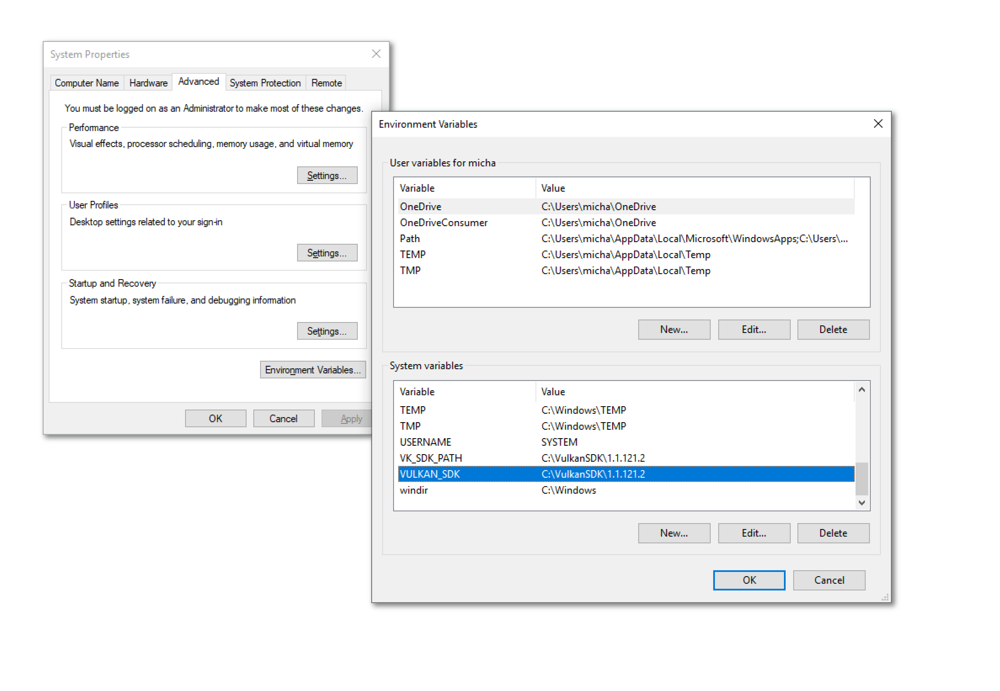
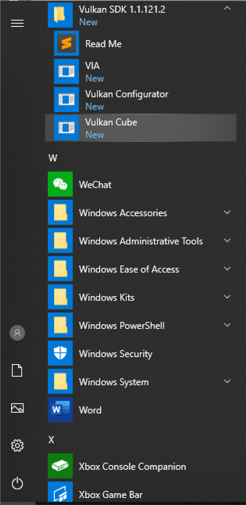
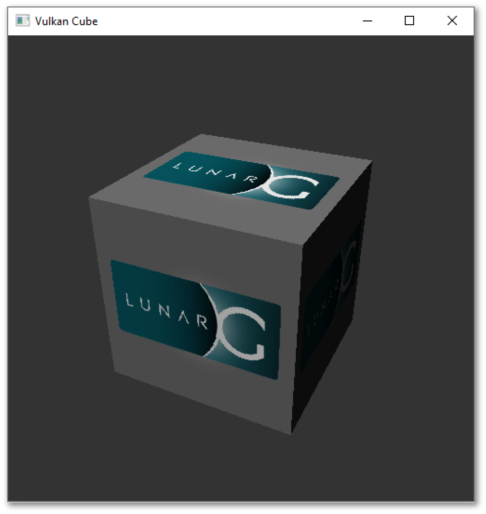
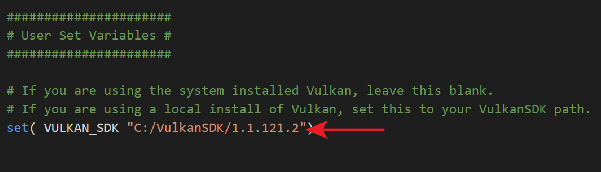
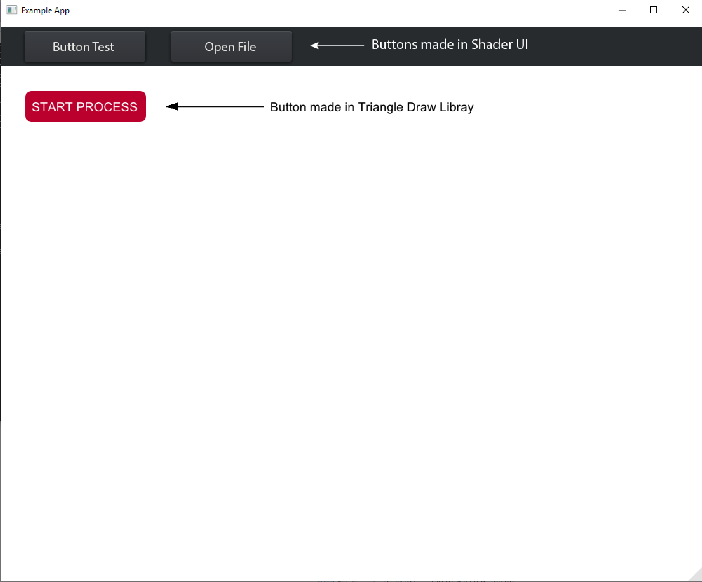

# **Install Notes for Windows**

[(1) Set up Windows dev environment](#1-Set-up-Windows-dev-environment)  
[(2) Install Vulkan](#2-Install-Vulkan)  
[(3) Install dependencies](#3-Install-dependencies)  
[(4) Open the project in Visual Studio Code](##4-Open-the-project-in-Visual-Studio-Code)  
[(5) Compile the project](#5-Compile-the-project)  
[(6) Start experimenting with the API](#6-Start-experimenting-with-the-API) 
[Library Dependencies](#other-issues-you-may-come-across-could-be-related-to-dependencies-required-by-the-libraries-we-use-documentation-for-libararies-used-in-exampleapp-can-be-found-here)

**Note:** &emsp; Please check [GPU Script - Vulkan Version Compatibility](Vulkan_Compatibility.md) before downloading Vulkan.

-----

## **(1) Set up Windows dev environment**

### Install Visual Studio Code and set up extensions.

[https://code.visualstudio.com/](https://code.visualstudio.com/)

These extensions are useful for building the project:

### Install the MSVC build tools.

Go to the [Visual Studio Downloads](https://visualstudio.microsoft.com/downloads/) page and download the installer for Visual Studio Community 2019:

Run the installer executable. You don't have to install the full Visual Studio Code development environment. Just install the **Desktop development with C++** tools. Make sure you install the MSVC Version 14.2 build tools and CMake.

-----

## **(2) Install Vulkan**

*Please check [GPU Script - Vulkan Version Compatibility](Vulkan_Compatibility.md) before installing Vulkan.*

### Download the installer for the LunarG VulkanSDK from here:

[https://vulkan.lunarg.com/sdk/home](https://vulkan.lunarg.com/sdk/home)

Run the installer. 

The installer will automatically add the VulkanSDK to your Windows PATH. The most recently installed SDK version will be referenced first in the PATH environment variable. In addition, the installer will add the VULKAN_SDK and VULKAN_SDK_PATH environment variables.

You can test whether Vulkan is working by running `Vulkan Cube`. Open `Vulkan Cube` by navigating to the Vulkan SDK folder in the Start Menu. 

If Vulkan is working on your machine, then you should see a spinning LunarG cube.

### If you have multiple versions of Vulkan installed and want to specify which version to use for the project, update [CMakeLists.txt](../CMakeLists.txt) to specify the path to the VulkanSDK you want to use.

-----

## **(3) Install dependencies**

### Install boost

Boost needs to be built with the same compiler that you are using to build ExampleApp. Download the pre-built boost binaries for MSVC compilers here: https://sourceforge.net/projects/boost/files/boost-binaries/1.70.0/

Look for the binary that matches MSVC Version 14.2.

Verify that the `BOOST_ROOT` path in [CMakeLists.txt](../CMakeLists.txt) is the same as where you installed boost. If you installed boost in a custom location, update the path to the location where you installed boost.

-----

## **(4) Open the project in Visual Studio Code**

### The first time you run Visual Studio Code on a C++ project, you may need to do some setup.

If you have installed the CMake Tools extension, you should see a blue bar at the bottom:

Click on `No Kit Selected`, and it should pop up a menu on the screen that lets you choose a compiler. Since we've installed the MSVC 14.2 build tools, we will use `Visual Studio Community 2019 Release - amd64` compiler.

If there are no kits found, run CMake Tool's `Scan for Kits` command. To open the command palette in VS Code, press   `⌘ + SHIFT + P`.

Once the kit has been found, the bottom blue bar should indicate it has found it.

### You will also need to specify the path to CMake to the CMake Tools settings file in Visual Studio Code.

To get the path for CMake, open the **Developer Command Prompt for Visual Studio**. This can be found in the Start Menu folder for Visual Studio:

In the prompt, run the command, `where cmake`, and it should print out the path. Copy the path.

Then, in Visual Studio Code open the CMake Tools settings file. You can do this by navigating to the **Extensions** pane in the side bar and clicking the gear icon under CMake Tools. It will pop up a context menu. Select **Configure Extension Settings**.

This opens up a UI to set settings for CMake Tools. Scroll down until you see **Cmake: Cmake Path**. Paste the path you copied into the text input box, then close the file.

-----

## **(5) Compile the project**

### Press `Build` to compile the project. 

You may see some warning during the compile process. As long as the executable builds, you can ignore the warnings.

### Open the ExampleApp executable and you should see:

-----

## **(6) Start experimenting with the API**

### Click here to [Get Started!](Get_Started.md)

-----

### Other issues you may come across could be related to dependencies required by the libraries we use. Documentation for libararies used in ExampleApp can be found here:

* [Vulkan](https://vulkan.lunarg.com/doc/sdk)
* [GLFW 3.3](https://www.glfw.org/)
* [GLM](https://glm.g-truc.net/0.9.9/index.html)
* [Dear ImGui](https://github.com/ocornut/imgui)
* [NativeFileDialog](https://github.com/mlabbe/nativefiledialog)
* [Intel](https://github.com/GameTechDev/PracticalVulkan)