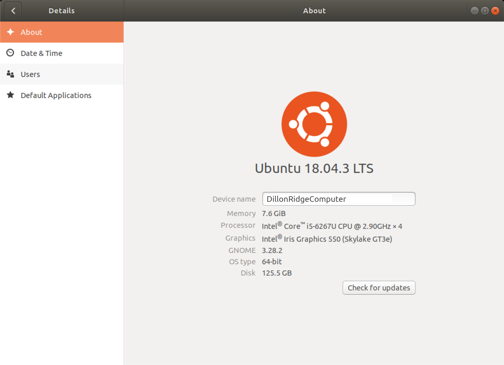
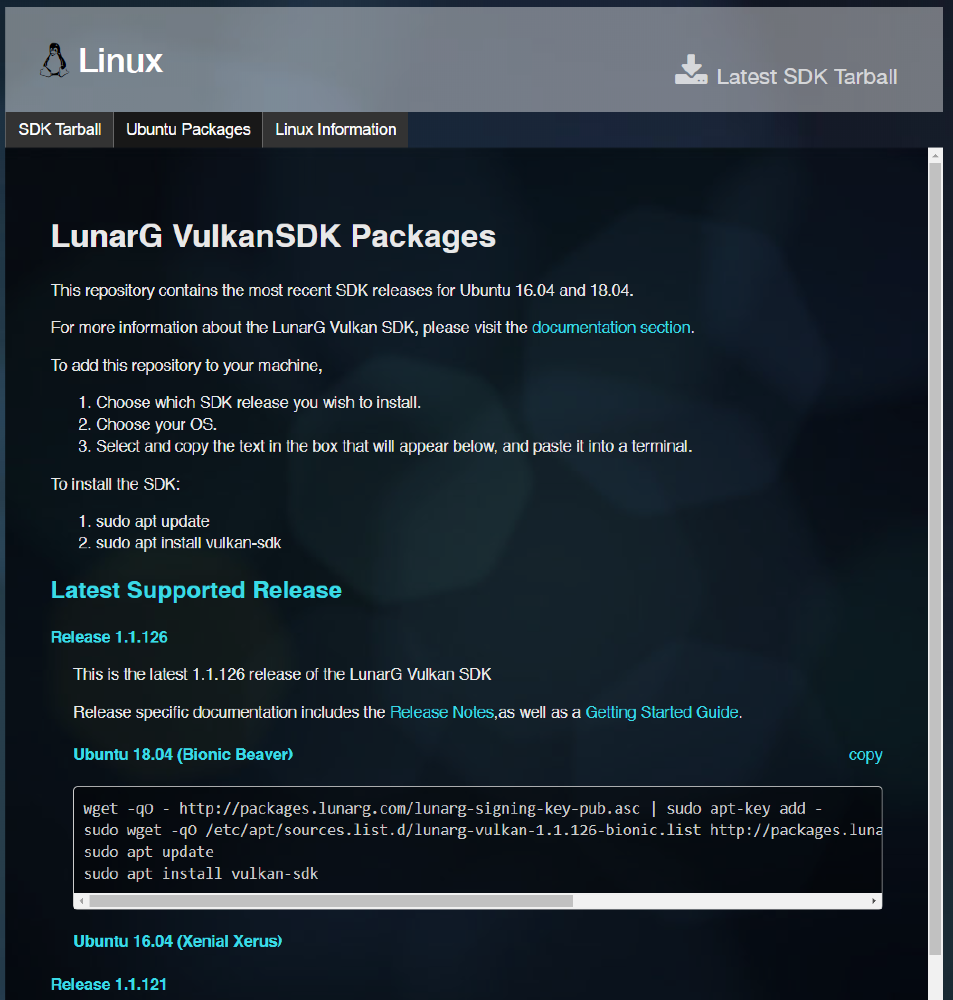
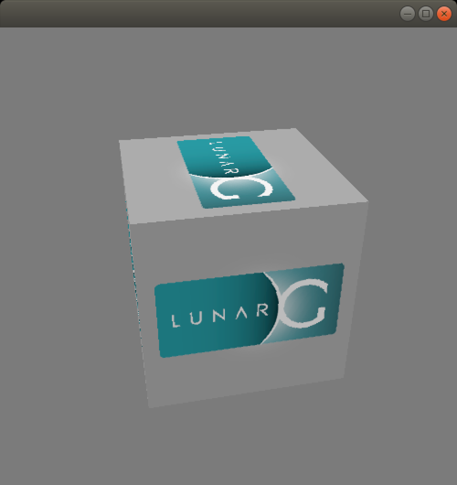
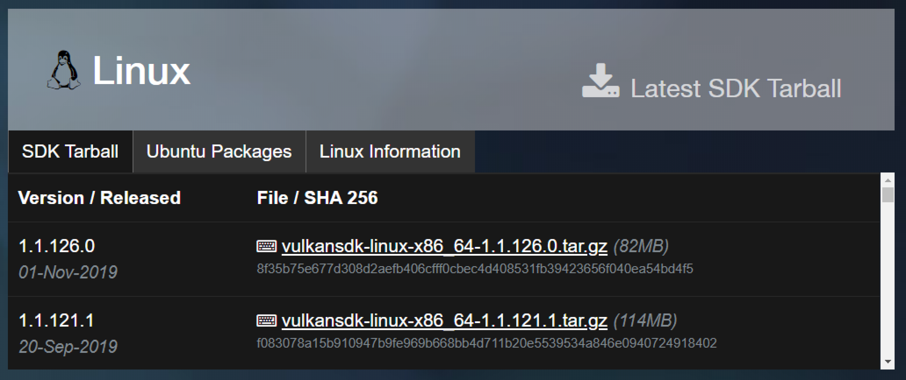
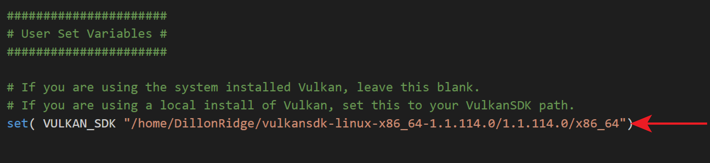
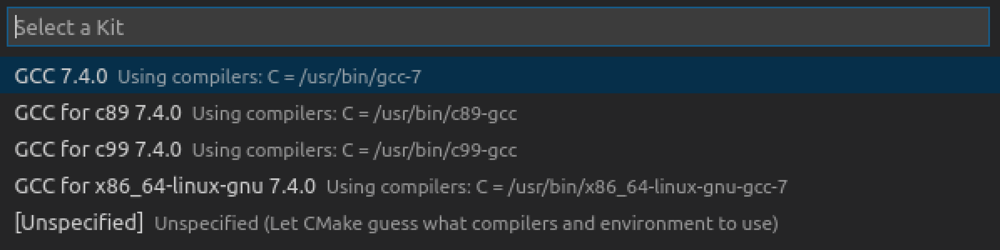
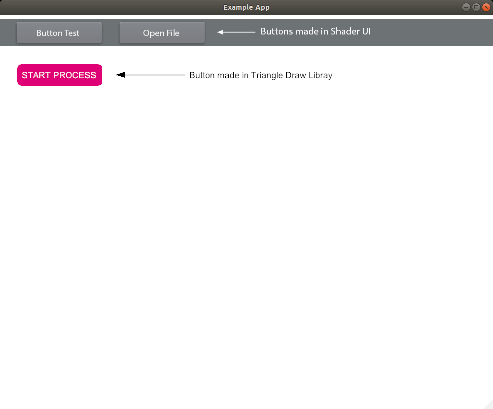

# **Install Notes for Ubuntu 18.04**

[(1) Set up Ubuntu dev environment](#1-Set-up-Ubuntu-dev-environment) <br>
[(2) Install the Vulkan driver for your graphics card](#2-Install-the-Vulkan-driver-for-your-graphics-card) <br>
[(3) Install Vulkan](#3-Install-Vulkan) <br>
[(4) Install dependencies](#4-Install-dependencies) <br>
[(5) Open the project in Visual Studio Code](#5-Open-the-project-in-Visual-Studio-Code) <br>
[(6) Compile the project](#6-Compile-the-project) <br>
[(7) Start experimenting with the API](#7-Start-experimenting-with-the-API)<br>
[Library Dependencies](#other-issues-you-may-come-across-could-be-related-to-dependencies-required-by-the-libraries-we-use-documentation-for-libararies-used-in-exampleapp-can-be-found-here)


**Note:** &emsp; Please check [GPU Script - Vulkan Version Compatibility](Vulkan_Compatibility.md) before downloading Vulkan.

-----

## **(1) Set up Ubuntu dev environment**

### Install Visual Studio Code and set up extensions.

[https://code.visualstudio.com/](https://code.visualstudio.com/)

These extensions are useful for building the project:


### Open a terminal and install the GCC compiler and CMake.

```
sudo apt install gcc
sudo apt install cmake
```
-----

## **(2) Install the Vulkan driver for your graphics card**

### Check what kind of graphics card you have by going to `Settings > Details > About`.



Get the latest drivers by enabling a PPA. 

If you already have these PPA's installed, you can skip the `sudo add-apt-repository` step. You can also check and manage what PPA's and external software you have installed by opening Ubuntu's **Software & Updates** and looking on the **Other Software** tab.

For **AMD / Intel**:

The [kisak-mesa PPA](https://launchpad.net/~kisak/+archive/ubuntu/kisak-mesa) or [oiabaf graphics drivers PPA](https://launchpad.net/~oibaf/+archive/ubuntu/graphics-drivers) are good options.

To install drivers using kisak-mesa PPA:
```
sudo add-apt-repository ppa:kisak/kisak-mesa
sudo apt update
sudo apt upgrade
sudo apt install libvulkan1 mesa-vulkan-drivers
```

Alternatively, you can use the oiabaf PPA:
```
sudo add-apt-repository ppa:oibaf/graphics-drivers
sudo apt update
sudo apt upgrade
sudo apt install libvulkan1 mesa-vulkan-drivers
```

For **NVIDIA**:

Enable the [Proprietary GPU Drivers PPA](https://launchpad.net/~graphics-drivers/+archive/ubuntu/ppa) to get the latest NVIDIA drivers.

```
sudo add-apt-repository ppa:graphics-drivers/ppa
sudo apt update
sudo apt upgrade
```

Check the latest driver version available to you:
```
ubuntu-drivers devices
```

Install the desired driver:
```
sudo apt install nvidia-driver-440
```

**Reboot after you install your drivers.**

*References:*
* [https://linuxconfig.org/install-and-test-vulkan-on-linux](https://linuxconfig.org/install-and-test-vulkan-on-linux)
* [https://steamcommunity.com/app/221410/discussions/6/1742227264188882438/](https://steamcommunity.com/app/221410/discussions/6/1742227264188882438/)
* [https://github.com/lutris/lutris/wiki/Installing-drivers](https://github.com/lutris/lutris/wiki/Installing-drivers)

-----

## **(3) Install Vulkan**

*Please check [GPU Script - Vulkan Version Compatibility](Vulkan_Compatibility.md) before installing Vulkan.*

**If you plan to install Vulkan 1.2, check with your GPU hardware vendor to see whether they have a driver that supports it.**

>The LunarG SDK for Vulkan 1.2 currently does not include a Vulkan driver. You will need to check with your GPU hardware vendor for a Vulkan Installable Client Driver (ICD). The SDK will allow you to build Vulkan applications but you will need a Vulkan ICD to execute them. 
>* [NVIDIA Drivers](https://developer.nvidia.com/vulkan-driver) (Version 440.48.02 supports Vulkan 1.2)
>* [AMD Drivers](https://gpuopen.com/vulkan-1-2-driver-available-latest-radeon-software-adrenalin-2020-edition-20-1-2/)
>* [Intel Drivers](https://downloadcenter.intel.com/product/80939/Graphics-Drivers) (Version 26.20.100.7755 supports Vulkan 1.2)

### **Option 1:** &emsp; Easy Install With the LunarG VulkanSDK Ubuntu Package <br> *This installs Vulkan to your system paths. <br> Use this option if you do not have Vulkan already installed on your machine.*

### Get instructions for installing the LunarG VulkanSDK with an Ubuntu Package from here:

[https://vulkan.lunarg.com/sdk/home](https://vulkan.lunarg.com/sdk/home)



This will install Vulkan to your system.

You can test whether Vulkan is working by running `vkcube` in the terminal. You should see a spinning LunarG cube.



### **Option 2:** &emsp; Install Vulkan to a Local Folder  <br> *Use this option if you plan on having multiple verions of Vulkan on your machine.*

### Download the tarfile for the LunarG VulkanSDK from here:

[https://vulkan.lunarg.com/sdk/home](https://vulkan.lunarg.com/sdk/home)



Unzip the file to a location of your choice.

### Set up the the runtime environment.

This ensures that when you run a Vulkan application, you are using the correct version. 

Manually set the environment variables:

```cpp
export VULKAN_SDK=~/<PATH TO SDK>/1.1.xx.y/x86_64
export PATH=$VULKAN_SDK/bin:$PATH
export LD_LIBRARY_PATH=$VULKAN_SDK/lib:$LD_LIBRARY_PATH
export VK_LAYER_PATH=$VULKAN_SDK/etc/vulkan/explicit_layer.d
```

Or run the setup script that is provided in the top-level directory of your SDK installation. Use the source command to load that script into your current shell:

```
source ~/<PATH TO SDK>/1.1.xx.y/setup-env.sh
```

You can test whether Vulkan is working by running `<PATH TO SDK>/bin/vkcube`. You should see a spinning LunarG cube.

### If you have multiple versions of Vulkan installed and want to specify which version to use for the project, update [CMakeLists.txt](../CMakeLists.txt) to specify the path to the VulkanSDK you want to use.

This ensures that the program is compiled with the correct Vulkan header version you want to use.



-----

## **(4) Install dependencies**

### Install boost.
```
sudo apt install libboost-all-dev
```

### Install dependencies for GLFW.
```
cd ~
sudo apt install libxinerama-dev
sudo apt install libxcursor-dev
sudo apt install libosmesa6-dev
```

### Install dependencies for NativeFileDialog.
```
sudo apt install libgtk-3-dev
```

-----

## **(5) Open the project in Visual Studio Code**

### The first time you run Visual Studio Code on a C++ project, you may need to do some setup.

If you have installed the CMake Tools extension, you should see a blue bar at the bottom:


Click on `No Kit Selected`, and it should pop up a menu on the screen that lets you choose a compiler. Since we've installed GCC, we will use `GCC 7.4.0`.



If there are no kits found, run CMake Tool's `Scan for Kits` command. To open the command palette in VS Code, press   `⌘ + SHIFT + P`.


Once the kit has been found, the bottom blue bar should indicate it has found it.


-----

## **(6) Compile the project**

### Press `Build` to compile the project. 

You may see some warning during the compile process. As long as the executable builds, you can ignore the warnings.


### Open the ExampleApp executable and you should see:



-----

## **(7) Start experimenting with the API**

### Click here to [Get Started!](Get_Started.md)

-----

### Other issues you may come across could be related to dependencies required by the libraries we use. Documentation for libararies used in ExampleApp can be found here:

* [Vulkan](https://vulkan.lunarg.com/doc/sdk)
* [GLFW 3.3](https://www.glfw.org/)
* [GLM](https://glm.g-truc.net/0.9.9/index.html)
* [Dear ImGui](https://github.com/ocornut/imgui)
* [NativeFileDialog](https://github.com/mlabbe/nativefiledialog)
* [Intel](https://github.com/GameTechDev/PracticalVulkan)