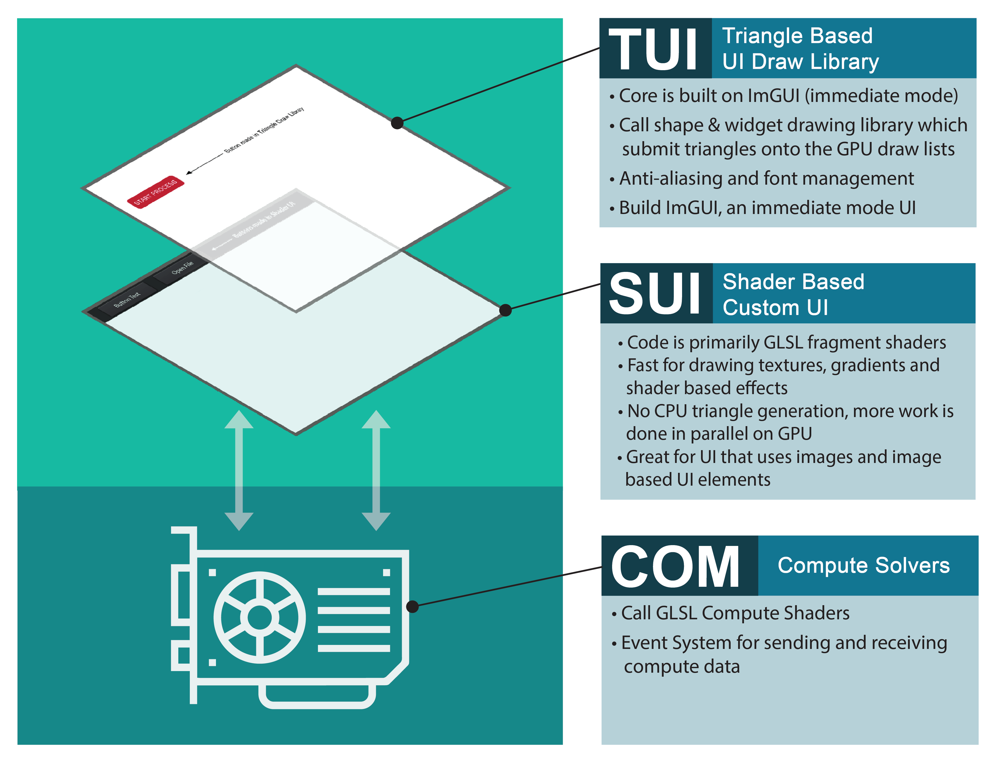

# **GPU Compute**

## **Outline**

* [Overview](#overview)
* [The COM Solver](#the-com-solver)
* [Inheriting from COM_PipelineBase](#inheriting-from-com_pipelinebase)

## **Overview**

In addition to graphics, Vulkan allows you to perform compute operations on the GPU. So, in the same spirit of SUI and TUI, we've added the ability to include compute pipelines in GPU Script. This compute layer is called COM and runs independently of SUI and TUI. 



## **The COM Solver**

In the graphics pipelines, SUI and TUI panes inherit from the the `SUI_PipelineBase` and `TUI_PaneBase` classes respectively. Similarly, in COM solvers inherit from the `COM_PipelineBase` class. 

The `COM_PipelineBase` defines a default compute pipeline where you can:

* pass data to the GPU via a storage buffer
* do some computation on the GPU as specified by a compute shader
* return data to the CPU via a storage buffer

You can create a custom COM solver class by inheriting from `COM_PipelineBase` and overriding certain methods. See below for more details on [inheriting from `COM_PipelineBase`](#inheriting-from-com_pipelinebase).

COM solvers are created and organized in [user_Solvers.cpp](../Include/User/user_Solvers.cpp) in the `ComputeManager::InitSolvers()` definition. The method `AddCOM` creates a new compute pipeline object and maps it to a string identifier.

For example, the following code creates a new `COM_PipelineBase` object and maps it to the string indentifier "Basic Compute":

```cpp
AddCOM<COM_PipelineBase> ( "Basic Compute" );
```

### Initialization

In GPU Script, all pipeline objects are initialized at the beginning. So after these COM solvers are created, they are initialized. 

During initialization:

* Storage buffers are created. The size is specified and memory allocation occurs at this step.
* The compute pipeline is defined and created.
* The storage buffers are bound to the pipeline as descriptor sets.


### Executing the Compute

Once the COM solver is initialized, it can be executed at any time. We wired up the "Basic Compute" example to run when you hit the key "c". Notice in [c_PipelineManager.cpp](../Include/ProjectSetup/c_PipelineManager.cpp), we call the method `ExecuteCompute` and pass in our string identifier:

```cpp
void PipelineManager::OnKeyPress( int key ) {
        if (key == 67 ) {
            ExecuteCompute( "Basic Compute" );                // Run compute when key "c" is pressed.
        } 
        ...
```

During execution:

* The next available compute resource is retrieved. By default, we set there to be 3 available compute resources. That means you can run 3 compute operations simultaneously. You can change the number of resources available to you by modifying `ComputeResourceCount` in [user_AppDataIO.h](../Include/User/user_AppDataIO.h).
* Any data that the GPU needs is passed from the CPU to the GPU
* The GPU does the compute calculations in the background
* Once the calculations finish, it triggers a Vulkan fence, which tells the CPU that the calculation is completed

The "Basic Compute" example simply takes 2 floats (`7.0f` and `10.0f`) and adds `7.5` to each of them. It then gets the floats back and prints them to the terminal. The data is passed to the GPU in the `ProcessInputs()` method, and it is retrieved in `ProcessOutputs()`.

## **Inheriting from COM_PipelineBase**

`COM_PipelineBase` provides you with the basic set-up needed to initialized and execute compute on the GPU. You can use this as a base class and override a few methods to implement your compute operations.

Take a look at the Mandelbrot example in the [COM_Solvers](../Include/COM_Solvers) folder. The `COM_Mandelbrot` class inherits from `COM_PipelineBase` and overrides the following methods:

* The constructor:
    * Specify the path to the compute shader [COM_mandelbrot.comp](../Shaders/COM_mandelbrot.comp)
    * Specify the number of workgroups that the compute shader needs in the X, Y, and Z dimensions. Compute workgroups in Vulkan are similar to their implementation in OpeGL. Basically, this tells the GPU how much work there is, and how to divide it up. Check out this [OpenGL Wiki page on compute shaders](https://www.khronos.org/opengl/wiki/Compute_Shader) for details on writing compute shaders. Note that you need to both tell Vulkan about the work groups and explicitly set it in your shader.

    The Mandelbrot set rendered is 3200px by 2400px. In the GPU, this is processed in workgroups of size 32 in each of the X and Y dimensions. Thus, the number of workgroups in the X direction is `3200 / 32` and the number of workgroups in the Y direction is `2400 / 32` to the next whole number.

    ```cpp
    const int WIDTH = 3200; // Size of rendered mandelbrot set.
    const int HEIGHT = 2400; // Size of renderered mandelbrot set.
    const int WORKGROUP_SIZE = 32; // Workgroup size in compute shader.

    ...

    COM_Mandelbrot::COM_Mandelbrot( PipelineManager &parent ) :
        COM_PipelineBase( parent ) {
        Parameters.shader_comp_path = "Shaders/COM_Mandelbrot.comp.spv";
        NbWorkgroups = {ceil(WIDTH / float(WORKGROUP_SIZE)), ceil(HEIGHT / float(WORKGROUP_SIZE)), 1};
    }
    ```

* `CreateStorageBuffers()`
    * The default in `COM_PipelineBase` assumes there is an input and output buffer. In the Mandelbrot example, we have no inputs and require an output buffer that stores 3200 x 2400 pixels.

    ```cpp
    void COM_Mandelbrot::CreateStorageBuffers() {

        Parameters.StorageBuffers.resize(1);

        // Output buffer
        Parameters.StorageBuffers[0].Size = sizeof(Pixel) * WIDTH * HEIGHT;
        Parameters.StorageBuffers[0] = Parent.CreateBuffer( Parameters.StorageBuffers[0].Size , vk::BufferUsageFlagBits::eStorageBuffer, vk::MemoryPropertyFlagBits::eHostVisible );

    }
    ```

* `ProcessInputs()`
    * Since we do not have an input buffer, we override `ProcessInputs()` to do nothing.

* `ProcessOutputs()`
    * We override `ProcessOutputs()` to map the buffer contents to a vectors and save it out as a .png.

    ```cpp
    void COM_Mandelbrot::ProcessOutputs() {

        // Code modified from Vulkan Minimal Compute example
        // https://github.com/Erkaman/vulkan_minimal_compute
        // Copyright (c) 2017 Eric Arnebäck
        // The MIT License (MIT)

        std::cout << "--- COM_Mandelbrot::SubmitComplete     Mapping back memory" << std::endl;

        void* mappedMemory = NULL;
        // Map the buffer memory, so that we can read from it on the CPU.
        Parent.GetDevice().mapMemory( *Parameters.StorageBuffers[0].Memory, 0, Parameters.StorageBuffers[0].Size, {}, &mappedMemory);
        Pixel* pmappedMemory = (Pixel *)mappedMemory;

        // Get the color data from the buffer, and cast it to bytes.
        // We save the data to a vector.
        std::vector<unsigned char> image;
        image.reserve(WIDTH * HEIGHT * 4);
        for (int i = 0; i < WIDTH*HEIGHT; i += 1) {
            image.emplace_back((unsigned char)(255.0f * (pmappedMemory[i].r)));
            image.emplace_back((unsigned char)(255.0f * (pmappedMemory[i].g)));
            image.emplace_back((unsigned char)(255.0f * (pmappedMemory[i].b)));
            image.emplace_back((unsigned char)(255.0f * (pmappedMemory[i].a)));
        }

        // Done reading, so unmap.
        Parent.GetDevice().unmapMemory( *Parameters.StorageBuffers[0].Memory );

        // Now we save the acquired color data to a .png.
        fs::path save_path = AppData.RootPath / "mandelbrot.png";
        unsigned error = lodepng::encode(CONVERT_PATH(save_path), image, WIDTH, HEIGHT);
        if (error) printf("encoder error %d: %s", error, lodepng_error_text(error));

        std::cout << "--- COM_Mandelbrot::SubmitComplete     Finished" << std::endl;
    }
    ```

If you look [user_Solvers.cpp](../Include/User/user_Solvers.cpp), you can see we've added "Mandelbrot" as an example. We wired up the "Mandelbrot" example to run when you hit the key "m".

The Mandelbrot example and code was borrowed from the [Vulkan Minimal Compute](https://github.com/Erkaman/vulkan_minimal_compute) project.