# **Layout Tutorial**

## **Outline**

* [Application Layout](#Application-Layout)
* [Simple Example](#Simple-Example)
* [Symbols](#Symbols)
* [Dividing Up Boxes](#Dividing-Up-Boxes)
* [Hierarchy](#Hierarchy)
* [Layout With Parenting](#Layout-With-Parenting)
* [Adding Window Panes](#Adding-Window-Panes)
* [Extra Features - Floating Window](#Extra-Features---Floating-Window)

---

## **Application Layout**

GPU Script has a powerful and flexible UI system where you can:
* define window panes
* define behavior during reize using simple symbols

## **Simple Example**

A typical application with 3 panes might look like this:

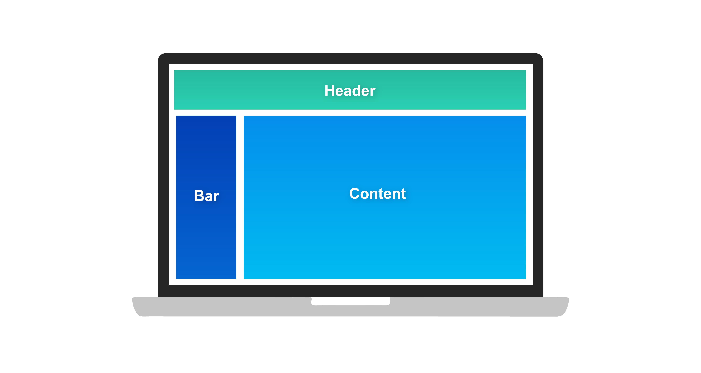

A standard setup for resize is:
* a side bar of fixed width
* the header and content expand to fill available space

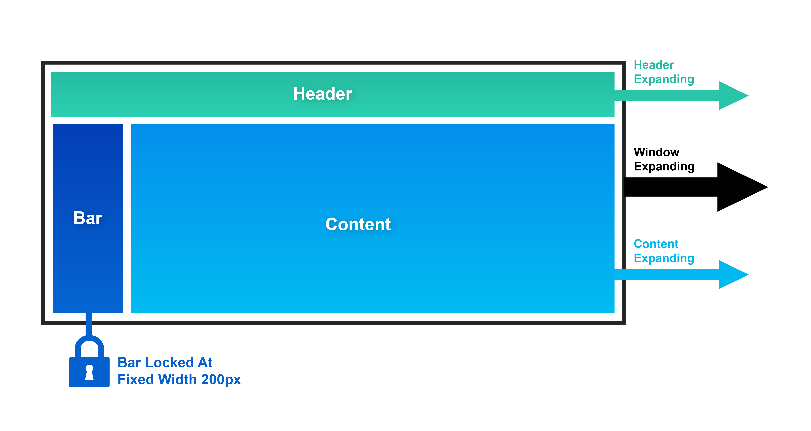

## **Symbols**

To keep things simple, 4 symbols control pane resizing.

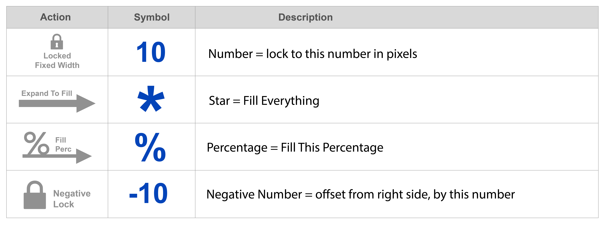

Now, let's see how these symbols describe this layout.

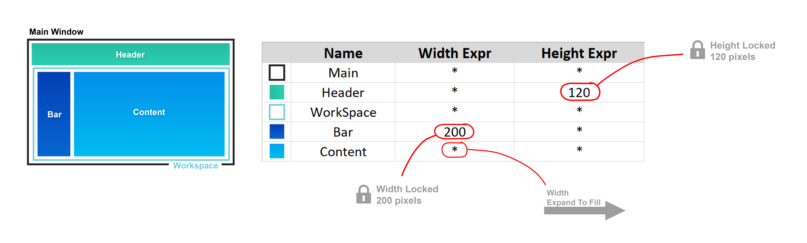

## **Dividing Up Boxes**

Most layouts are basically boxes within boxes. So, each pane in the layout needs to tell the layout which box it's in.

We can think of the layout being generated in steps of boxes placed in boxes.

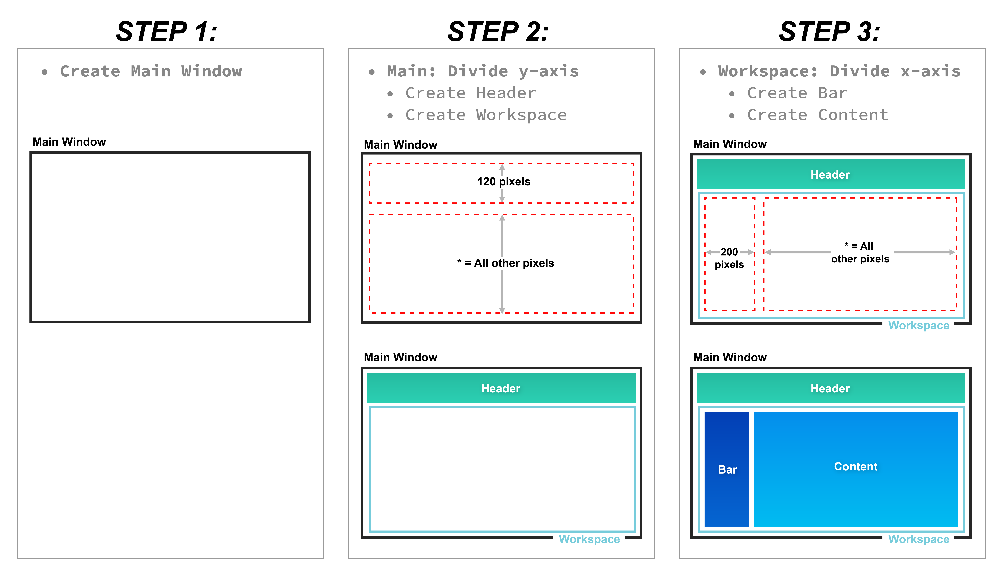

## **Hierarchy**

You can see there's a simple hierarchy of which boxes are in which boxes.

Think of it as evaluating from the top downward, figuring out the window bane locations.

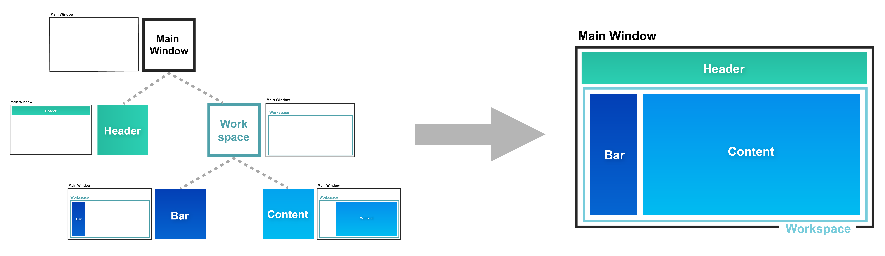

## **Layout With Parenting**

The layout instructions passed to the application also include a description of `Parent` and `Split`.

The `Parent` column describes the hierarchy for assembling the boxes. The value in the `Parent` column describes which box is above you in the hierarchy.

The `Split` column describes on which axis a box is divided.

For example, consider the following layout:

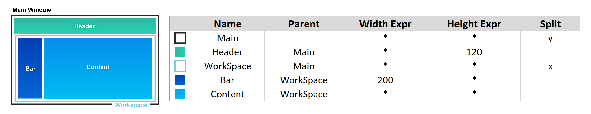

All layouts must start with the `Main` box, which encompasses the whole window.

In this layout, `Main` has 2 children: `Header` and `Workspace`. These arrangement of these two children boxes is split along `Main`'s ***y*** axis.

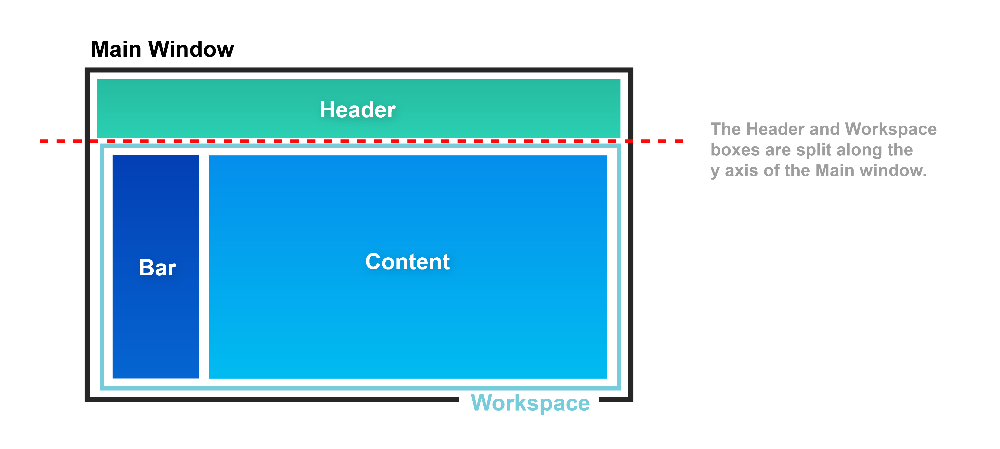

Continuing down the hierarchy, we can see that `Workspace` also has 2 children: `Bar` and `Content`. As described in the layout, the arrangement of these two childre is split along `Workspace`'s ***x*** axis.

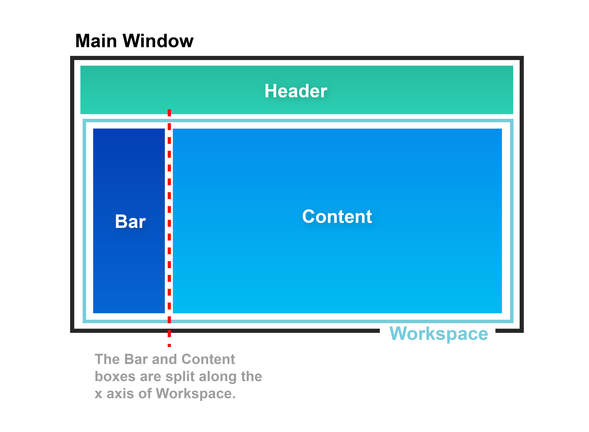

This is all we need to correctly describe a layout.

In C++, it would look like this:

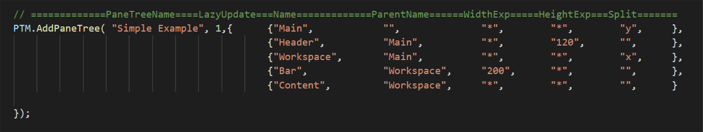

## **Adding Window Panes**

A more complex application would typically also include a footer pane and a right hand side bar.

Here's what that might look like:

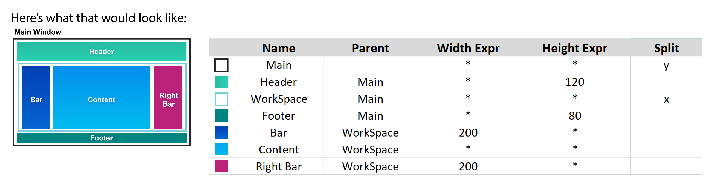

Notice that there are panes that don't really draw anything. In this example: `Main` and `Workspace`.

These are called **Construction Panes**. You need them to calculate the layout, but you don't wire them to any class objects. After the window dimensions are calculated, these **Construction Panes** are ignored.

Here's what this layout would look like in C++:

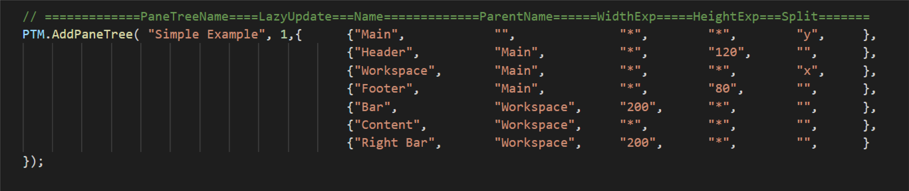

## **Extra Features - Floating Window**

There are many applications that have a content window that fills the screen and overlay UI that *floats* above the content window. 

This is common in video games, scientific editors, and art tools.

For this scenario, the layout language needs to expand slightly.

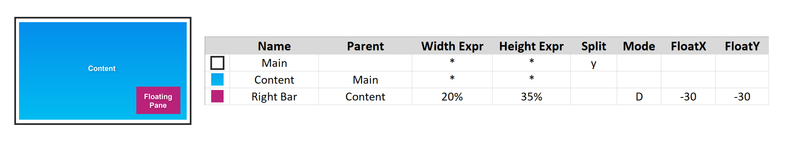

This layout includes settings for `FloatX` and `FloatY`, which set the ***x*** and ***y*** positions for a floating pane. 

If `FloatX` and `FloatY` are left blank, then it is considered a normal pane where the positions are set by the layout as described in the previous sections. If there are any values in these fields, then it is considered a floating pane.

Also, not athat we are setting the `Width` and `Height` by a percentage, rather than fixed sizes in pixels.

Here's what it look like in C++:

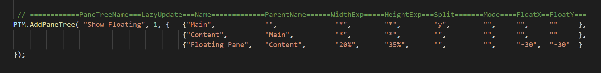

Notice that we are using the negative symbol (`-`), so the positions of the floating pane are offset from the right and bottom edges.

If we had set `FloatX = 30` and `FloatY = 30`, with positive number, then it would look like this:

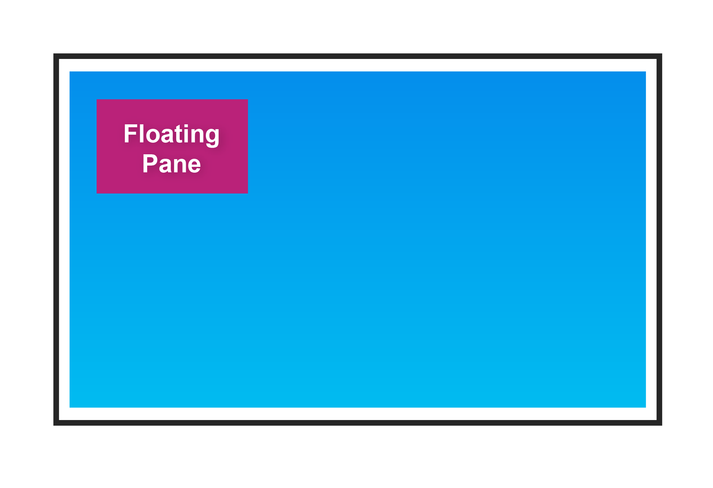

Also in this example, is a new column called `Mode`. This lets you pass metadata from the layout to the pane. In this case, the `Mode = D` means that the floating pane is draggable.