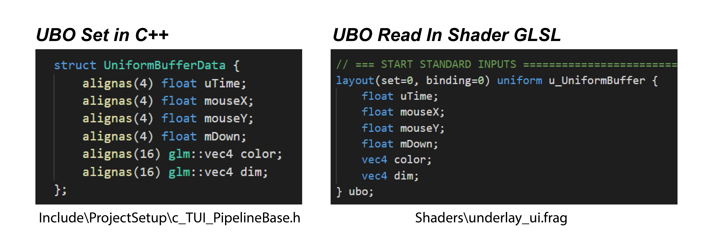
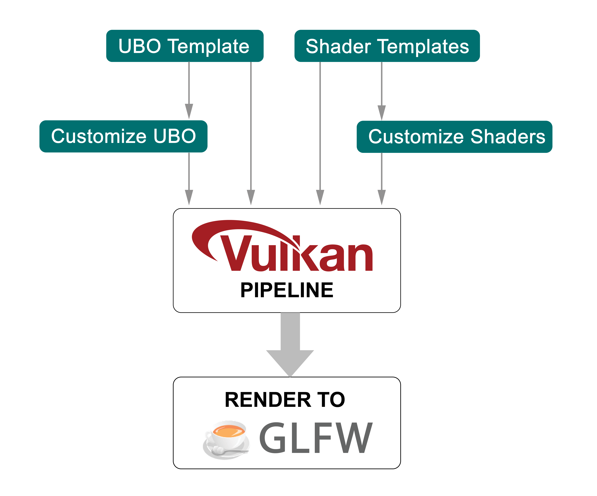
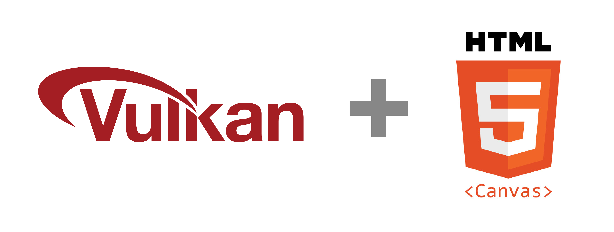
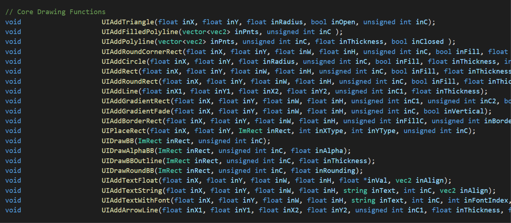
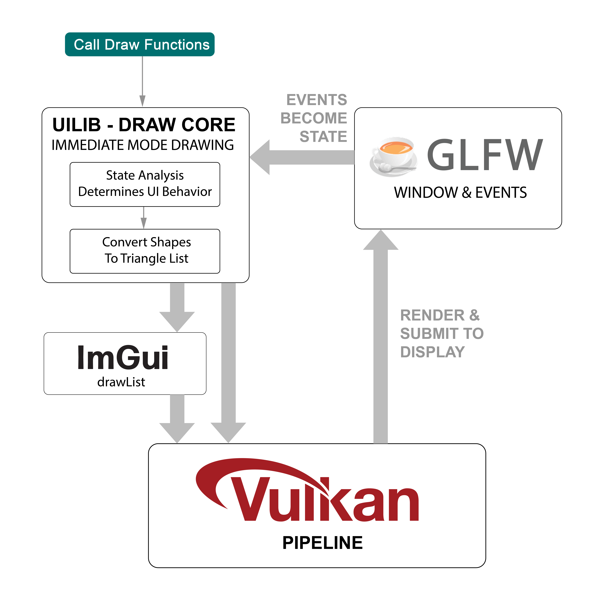

# **SUI vs TUI - Details &  Differences**

When working with GPU Script, you will likely want to:
* Understand the exact differences between SUI & TUI
* Know why these 2 systems exist
* See which is the best for a given UI Pane or Widget

So...here are the details on [SUI](#) and [TUI](#-1).

## 

 
 
 

 

### At it's core, SUI is a raw Vulkan Pipeline template with all the necessary components for submitting to the GPU. SUI Panes build off of this template and allow you to:

* Customize UBO (uniform buffer) data to pass into GLSL shaders:

    * Add shader inputs: `float`, `vec2`, `vec3`, `vec4`
    * Add lists of: vertices, indices, uvs, and metadata

* Customize your shaders:

    * Tune GLSL code to modify shader behavior

We make it easy, so you can ignore as much of Vulkan as you want. Vulkan is awesome, but is very low level and ard to learn.

### GPU Script also includes many examples to help you make your SUI Panes:

* UI building libraries for common use cases

* Templates for turning images into buttons

    * Sprite and Decal placement
    * Mouse-overs and Bounding Boxes
    * See [underlay_ui.frag](../Shaders/underlay_ui.frag)

* Templates for porting [shadertoy](https://www.shadertoy.com/) code:

    * See [ocean.frag](../Tutorials/T01_Ocean/ocean.frag)

* Template for UBO - Uniform Buffer Object:

    * Common shader inputs are already there

### Every pane in Vulkan that uses SUI is a unique pipeline.   Mechanically, SUI is exactly a standard Vulkan Pipeline:

 
 

## 

### TUI is our high level drawing library.   It's designed to keep things simple and work focused on UI coding.   Big picture - you can think of it like a mash up of Vulkan and HTML 5 Canvas.

 
 

 

### You can see the main drawing functions in the file: [UILib/UILib.h](../UILib/UILib.h):

### The main features of this library are:

* 2D Shape Drawing
* Bounding Box Management
* Events and Input States
* UI Widgets - examples: slider, scroller
* High Level Layout Tools - coming soon!

The authors of GPU Script have written several UI Libraries in the past. This is the amalgamation of lessons learned over the years. GPU Script has many features to make powerful and good-looking UI quickly.

### TUI as a mechanical system:

* Converts drawing commands into 2D trianges and vertex color fringes for anti-aliasing
* Uses a single Vulkan Pipeline for all panes
* No customization neede - just call the draw functions
* Under the hood uses some low level features from [ImGui](https://github.com/ocornut/imgui)

 
