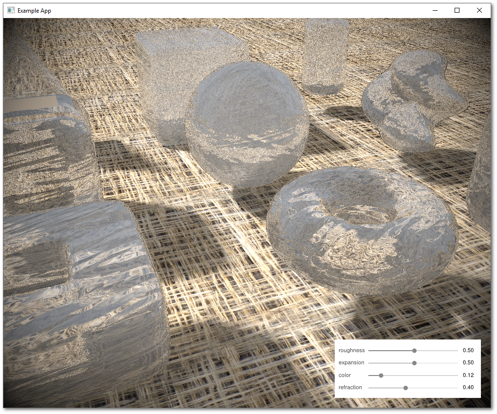
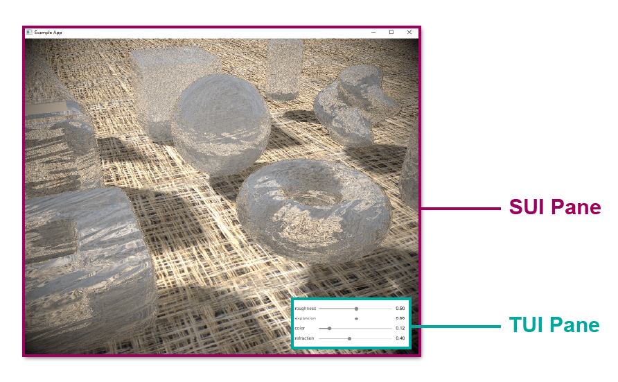

# **Ice Example**



## **Outline**

* [Overview](#overview)
* [One SUI Pane and One TUI Panes](#one-sui-pane-and-one-tui-pane)
* [Converting Shadertoy to Vulkan Shaders](#converting-shadertoy-to-vulkan-shaders)
* [Updating AppDataIO](#updating-appdataio)
* [Creating the SUI Pane](#creating-the-sui-pane)
    * [The IceSUI Class Definition](#the-icesui-class-definition)
    * [Custom UBO](#custom-ubo)
    * [The IceSUI Constructor](#the-icesui-constructor)
    * [Overriding `UpdateUniformBuffer()`](#overriding-updateuniformbuffer)
* [Creating the TUI Pane](#creating-the-tui-pane)
    * [The IceSUI Class Definition](#the-icesui-class-definition)
    * [The IceSUI Constructor](#the-icesui-constructor)
    * [Adding UI Elements](#adding-ui-elements)
* [Adding the Include Statement](#adding-the-include-statement)
* [Adding the Layout](#adding-the-layout)
* [Set the Current Layout Displayed to the Ocean Example](#set-the-current-layout-displayed-to-the-ocean-example)
* [Update CMakeLists](#update-cmakelists)
* [(Optional) Make it Draggable](#optional-make-it-draggable)

## **Overview**

This is an example for integrating a shader from [Shadertoy](https://www.shadertoy.comp) with textures and a custom UBO. This example uses the shader code from [IcePrimitives](https://www.shadertoy.com/view/MscXzn) created by [Bers](https://www.shadertoy.com/user/Bers).

Files for the Ice Example are located in [~/Tutorials/T03_Ice](../Tutorials/T03_Ice). There are 6 files needed for this example:

* [ice.vert](../Tutorials/T03_Ice/ice.vert)
* [ice.frag](../Tutorials/T03_Ice/ice.frag)
* [SUI_Demo_Ice.h](../Tutorials/T03_Ice/SUI_Demo_Ice.h)
* [SUI_Demo_Ice.cpp](../Tutorials/T03_Ice/SUI_Demo_Ice.cpp)
* [TUI_Demo_Ice.h](../Tutorials/T03_Ice/TUI_Demo_Ice.h)
* [TUI_Demo_Ice.cpp](../Tutorials/T03_Ice/TUI_Demo_Ice.cpp)

We also need 2 textures located in [~/Tutorials/T03_Ice/Data](../Tutorials/T03_Ice/Data):
* [background.jpg](../Tutorials/T03_Ice/Data/background.jpg)
* [gray_noise.png](../Tutorials/T03_Ice/Data/gray_noise.png)

For the most part, the code is already integrated into the GUI Script framework. All that you need to do, is uncomment out a few lines. Here's a walkthrough of how to do it.

## **One SUI Pane and One TUI Pane**

This examples contains two panes. The ice graphics underneath is the SUI Pane, while the box with sliders is a TUI Pane.



To recap, TUI and SUI are different Vulkan pipelines. TUI Panes are processed by `TUI_PipelineBase` class, which is a Vulkan pipeline that processes the triangles generated by the `UILib` draw library and functions.

On the other hand, each SUI Pane is its own unique Vulkan pipeline. All SUI Panes must inherit from the `SUI_PipelineBase` class, which does all the necessary Vulkan pipeline setup for you. 

Check out the [Code Overview Diagram](./Code_Big_Picture_Diagram.pdf) for more details on how the framework is wired, and check out [SUI vs TUI - Details &  Differences](./Tutorials_SUIvsTUI.md) for details on how SUI and TUI work.

## **Converting Shadertoy to Vulkan Shaders**

The Vulkan pipeline for SUI Panes requires two shaders: a vertex shader and a fragment shader. These are already in the tutorial folder.

**Vertex Shader**

A template vertex shader is located in [~/Shaders/shader.vert](../Shaders/shader.vert). We copied this template for our vertex shader [ice.vert](../Tutorials/T03_Ice/ice.vert). Unless you need to pass additional per vertex data, you can just use the template vertex shader.

**Fragment Shader**

Many Shadertoy examples are basically fragment shaders. To make it work with Vulkan, we needed to make a few syntax tweaks and modify the inputs at the top of the file.

The Shadertoy used for this example is located here: https://www.shadertoy.com/view/MscXzn

We copied the code from the **Image** tab into our fragment shader [ice.frag](../Tutorials/T03_Ice/ice.frag). You may notice that the [IcePrimitives](https://www.shadertoy.com/view/MscXzn) example on Shadertoy also has a **BufferA** tab. We ignore the code in **BufferA** since it pertains to drawing the  sliders using shader code. Since our sliders are drawn as a TUI Pane, there is no need for the **BufferA** code. 

These are the modifications we made to the original Shadertoy code:

* In Shadertoy, the `mainImage()` function in to generate the procedural images by computing a color for each pixel. Vulkan fragment shaders use `main()` instead. 

    ```glsl
    //void mainImage( out vec4 fragColor, in vec2 fragCoord )
    void main()
    ```

* The Shadertoy code requires a number of inputs, which we added at the top of the file. This fragment shader is passed 3 user data inputs:
    * the UBO (uniform buffer object)
    * a texture for the gray noise
    * a texture for the background

    ```glsl
    layout(set=0, binding=0) uniform u_UniformBuffer {
        float uTime;
        float mouseX;
        float mouseY;
        float mDown;
        vec4 color;
        vec4 dim;
        float slider1;
        float slider2;
        float slider3;
        float slider4;
    } ubo;
    layout(set=0, binding=1) uniform sampler2D iChannel0;       // gray noise
    layout(set=0, binding=2) uniform sampler2D iChannel1;       // background


    layout(location = 0) in vec3 i_FragColor;
    layout(location = 1) in vec2 i_TexCoord;

    layout(location = 0) out vec4 fragColor;

    // standard variables put in Layout Pane space - ubo.dim [x,y,width,height]
    float iTime = ubo.uTime;
    vec2 iResolution = vec2( ubo.dim[2], ubo.dim[3]);
    vec2 fragCoord = vec2(gl_FragCoord.x - ubo.dim[0], iResolution.y - gl_FragCoord.y + ubo.dim[1]); // ShaderToy OGL ES is y inverted for Vulkan

    vec4 sliderVal = vec4(ubo.slider1, ubo.slider2, ubo.slider3, ubo.slider4);

    // for this tutorial mute out the mouse motion - just to simplify things
    // if you want to see the mouse motion drive movement, switch the comment in the iMouse definition below
    //vec2 iMouse = vec2(ubo.mouseX - ubo.dim[0], ubo.mouseY - ubo.dim[1]);  // mouse cord in pane (not window) 
    vec2 iMouse = vec2(0,0);
    ```

    In addition to the standard UBO inputs (time, mouse inputs, color, and dimensions), the UBO passed into [ice.frag](../Tutorials/T03_Ice/ice.frag) also include four additional inputs: 
    * slider1
    * slider2
    * slider3
    * slider4

    These correspond values for the four sliders in bottom right pane, which control roughness, expansion, color, and refraction. Moving these sliders will change the look of the ice primitives.

    Right underneath the UBO inputs are two lines:

    ```glsl
    layout(set=0, binding=1) uniform sampler2D iChannel0;       // gray noise
    layout(set=0, binding=2) uniform sampler2D iChannel1;       // background
    ```
    
    These indicate that the shader is expecting two textures. Shadertoy syntax uses `iChannel0` through `iChannel4` for textures. We pass the texture data to binding locations 1 and 2, corresponding with `iChannel0` and `iChannel1`. When we set up the pipeline for our SUI Pane, we will need to make sure the correct textures correspond with these two binding locations.

    In our templates, we always set the UBO at binding location 0, and any textures count up from binding location 1. Textures are specified in the SUI Pane constructor, which is discussed in more detail a later section below.

* Finally, we wired in the UBO slider inputs to variables needed by the shader, and removed all parts of the original Shadertoy code that handled inputs from `iChannel2`, which processed inputs from **BufferA**.

    ```glsl
    // Slider bound globals.
    float ROUGHNESS       = sliderVal[0] * 4.0;
    float ISOVALUE        = 0.005 + sliderVal[1]*0.1;
    float ICE_COLOR       = sliderVal[2];
    float REFRACTION_IDX  = 1.0 + sliderVal[3];
    ```

## **Updating AppDataIO**

Before we set up the SUI Pane, we want to make sure that we set up the shared data between SUI and TUI pipelines. The `AppDataIO` is a class that globally shares data and events across the application. It's the best way to pass data between SUI and TUI Panes (in this case, the shader and the slider). Both the ice fragment shader (SUI) and the slider bars (TUI) need to access the values for roughness, expansion, color, and refraction. 

The `AppDataIO` class is defined in [~/Include/Layouts/c_AppDataIO.h](../Include/Layouts/c_AppDataIO.h). There is one instance of `AppDataIO` that is created in [main.cpp](../main.cpp), and it is passed to every SUI and TUI object. 

We've put the following variables into the `AppDataIO` class definition.

```cpp
// Ice Demo
float                   Roughness = 0.5f;
float                   IsoValue = 0.5f;
float                   IceColor = 0.12f;
float                   Refraction = 0.4f;
```

The handle to the `AppDataIO` object is found in all SUI and TUI Panes, and is referenced by the variable `AppData`.

## **Creating the SUI Pane**

### The IceSUI Class Definition

SUI Panes must inherit from the `SUI_PipelineBase` class. In [SUI_Demo_Ice.h](../Tutorials/T03_Ice/SUI_Demo_Ice.h), the class definition for `IceSUI` inherits from `SUI_PipelineBase`:

```cpp
// ************************************************************ //
// IceSUI Class                                                 //
// ************************************************************ //
class IceSUI : virtual public SUI_PipelineBase {

public:

    IceSUI( PipelineManager &parent );
    virtual ~IceSUI();

private:

    // Overrided Draw methods
    void            UpdateUniformBuffer( SUI_PipelineData::DrawResourcesData & drawing_resources ) override final;

};
```

### Custom UBO

Because we are using a custom UBO, we will also need to include a struct definition for our custom UBO and override the `UpdateUniformBuffer` method to pass the custom UBO data into our fragment shader.'

The UBO struct definition is also found in [SUI_Demo_Ice.h](../Tutorials/T03_Ice/SUI_Demo_Ice.h), just above the `IceSUI` class definition:

```cpp
// ************************************************************ //
// IceUboData                                                   //
//                                                              //
// Struct describing uniform buffer data passed to shader       //
// ************************************************************ //
struct IceUboData {

    alignas(4) float uTime;
    alignas(4) float mouseX;
    alignas(4) float mouseY;
    alignas(4) float mDown;
    alignas(16) glm::vec4 color;
    alignas(16) glm::vec4 dim;
    
    alignas(4) float roughness;
    alignas(4) float isoval;
    alignas(4) float icecol;
    alignas(4) float refraction;

};
```

### The IceSUI Constructor

Definitions for the class methods are in [SUI_Demo_Ice.cpp](../Tutorials/T03_Ice/SUI_Demo_Ice.cpp). 

In the constructor definition, we do the following:

* Specify the relative paths to the shaders so the app knows where to find them.

* Specify the textures used listed in the same order as in the shader. Recall that in our shader, binding 0 is the UBO, and binding 1 is the gray noise, and binding 2 is the background.

    `TexturePaths` is a vector of `TextureMetaData` structs that hold information about the texture the application needs to know. `TextureMetaData` holds the following info:
    * the relative path to the texture
    * the mipmap mode (`eNearest` or `eLinear`)
    * the sample address mode (`eRepeat`, `eMirroredRepeat`, `eClampToEdge`, `eClampToBorder`, `eMirrorClampToEdge`, or `eMirrorClampToEdgeKHR`)

    ```cpp
    IceSUI::IceSUI( PipelineManager &parent ) :
        SUI_PipelineBase( parent ) {
        Parameters.shader_vert_path = "Shaders/ice.vert.spv";
        Parameters.shader_frag_path = "Shaders/ice.frag.spv";
        TexturePaths = { 
            { "Data/gray_noise.png", vk::SamplerMipmapMode::eNearest, vk::SamplerAddressMode::eClampToEdge},
            { "Data/background.jpg", vk::SamplerMipmapMode::eNearest, vk::SamplerAddressMode::eRepeat}
        };
    }
    ```

*Note: If you are building your own SUI Pane, we recommend placing your shader files in the [~/Shaders](../Shaders) folder. [CMakeLists.txt](../CMakeLists.txt) automatically searches for and compiles vertex and fragment shaders found in [~/Shaders](../Shaders). It then copies the compiled shaders into ~/build/Shaders. The executable is generated in the ~/build folder and all paths in the code are relative to the executable.*

When defining SUI Pane class objects, you also must make sure:

* the constructor definition takes in the argument `PipelineManager &parent`
* `&parent` is passed to the `SUI_PipelineBase` constructor

This ensures that the SUI Pane can access:

* the necessary Vulkan methods
* the `AppData` variable containing globally shared data 

### Overriding `UpdateUniformBuffer()`

In addition to the constructor, we also override the definition for `UpdateUniformBuffer` in order to handle our custom UBO: 

```cpp
void IceSUI::UpdateUniformBuffer( SUI_PipelineData::DrawResourcesData & drawing_resources ) {

    // Time passed since program start
    static auto startTime = std::chrono::high_resolution_clock::now();
    auto currentTime = std::chrono::high_resolution_clock::now();
    float time = std::chrono::duration<float, std::chrono::seconds::period>(currentTime - startTime).count();

    // Initialize custom Ubo
    IceUboData ubo = {};

    // Template Ubo intpus
    ubo.uTime = time;
    ubo.mouseX = (float) Parent.GetInputState().Position.X;
    ubo.mouseY = (float) Parent.GetInputState().Position.Y;
    Parent.GetInputState().Buttons[0].IsPressed ? ubo.mDown = 1: ubo.mDown = 0;
    ubo.dim = glm::vec4( X, Y, Width, Height );
    
    // Ubo inputs specific to ice example
    ubo.roughness = AppData.Roughness;
    ubo.isoval = AppData.IsoValue;
    ubo.icecol = AppData.IceColor;
    ubo.refraction = AppData.Refraction;

    // Copy Ubo data to buffer
    drawing_resources.UniformBuffer.Size = sizeof(ubo);
    drawing_resources.UniformBuffer = Parent.CreateBuffer( drawing_resources.UniformBuffer.Size , vk::BufferUsageFlagBits::eTransferDst | vk::BufferUsageFlagBits::eUniformBuffer, vk::MemoryPropertyFlagBits::eDeviceLocal );
    Parent.CopyDataToBuffer( drawing_resources.UniformBuffer.Size , &ubo, *drawing_resources.UniformBuffer.Handle, 0, vk::AccessFlags( 0 ), vk::PipelineStageFlagBits::eTopOfPipe, vk::AccessFlagBits::eUniformRead, vk::PipelineStageFlagBits::eFragmentShader );

    // Update Ubo Descriptor Set
    std::vector<vk::DescriptorBufferInfo> ubo_infos = {
        {
            *drawing_resources.UniformBuffer.Handle,                               // VkBuffer                       buffer
            0,                                                                     // VkDeviceSize                   offset
            drawing_resources.UniformBuffer.Size                                   // VkDeviceSize                   range
        }
        
    };
    Parent.UpdateDescriptorSet( *Parameters.DescriptorSet.Handle, vk::DescriptorType::eUniformBuffer, 0, 0, {}, ubo_infos );

}
```

Note: This code uses the definition for `SUI_PipelineBase::UpdateUniformBuffer` as a template, and makes a few minor changes to add `roughness`, `isoval`, `icecol`, and `refraction`.

## **Creating the TUI Pane**

### The IceTUI Class Definition

TUI Panes must inherit from the `TUI_PaneBase` class. In [TUI_Demo_Ice.h](../Tutorials/T03_Ice/TUI_Demo_Ice.h), note how the `IceTUI` inherits from `TUI_PaneBase`:

```cpp
// ************************************************************ //
// IceTUI Class                                                 //
//                                                              //
// TUI Pane for Ice Demo                                        //
// ************************************************************ //
class IceTUI : virtual public TUI_PaneBase {

public:

    IceTUI( AppDataIO & inAppData );
    ~IceTUI();
    
    void                DrawPane() override final;
    bool                Draggable = false;
    float               TitleBarHeight = 10.0f;

private:

    void                InitDraw();
    void                DrawUI();

};
```

### The IceTUI Constructor

When defining TUI Pane class objects, you must make sure:

* the constructor definition takes in the argument `AppDataIO & inAppData`
* `&inAppData` is passed to the `TUI_PaneBase` constructor

This ensures that the TUI Pane can access the `AppData` variable, which contains the globally shared data.

```cpp
IceTUI::IceTUI( AppDataIO & inAppData ) :
    TUI_PaneBase( inAppData ) {
}
```

### Adding UI Elements

The `IceTUI` class also overrides the `DrawPanes()` method from `TUI_PaneBase`. When Vulkan processes the TUI pipeline, it calls the `DrawPanes()` method for every TUI Pane described in the active layout. Currently, `UILib` layers high level drawing functions over low-level `ImGui` components, so the drawing code will include methods both under the `UILib` namespace and the `ImGui` namespace. `UILib` methods are alway prefixed by `UI` to disambiguate between the two libraries.

```cpp
void IceTUI::DrawPane() {
        
    StartPane();
    ImGuiIO& io = ImGui::GetIO();

    static bool initialized;
    if (!initialized) {InitDraw(); initialized = true;}

    if (Mode.find('D') != std::string::npos){                   // draggable
        Draggable = true;
        ImGui::SetNextWindowPos( ImVec2(X,Y), ImGuiCond_Once );
        ImGui::SetNextWindowSize( ImVec2( Width, Height ), ImGuiCond_Once );
        ImGui::Begin( "Ice Sliders");
        ImGuiContext& g = *GImGui;
        Width = g.CurrentWindow->Size.x;
        Height = g.CurrentWindow->Size.y;
    }
    else{
        Draggable = false;
        ImGui::SetNextWindowPos( ImVec2(X,Y) );                 // not draggable
        ImGui::SetNextWindowSize( ImVec2( Width, Height ) );
        ImGui::Begin( "Ice Sliders", NULL, ImGuiWindowFlags_NoTitleBar | ImGuiWindowFlags_NoScrollbar | ImGuiWindowFlags_NoResize );
    }
    
    DrawUI();
    
    ImGui::End();
    FinishPane();

}
```

In the previous [Ocean Example](Tutorials_ShaderToy_Ocean.md), we used a basic template for `DrawPanes()`. In this example, we modified that template to include an option for making the TUI Pane draggable:

1. **Initialize the UI**:

    * Call `StartPane()`

    * Call any initialization code that needs to be run only once:

        ```cpp
        static bool initialized;
        if (!initialized) {InitDraw(); initialized = true;}
        ```

        Currently, `InitDraw()` is left blank and left as a place holder where you can add initialization code that you only need to call once.

        ```cpp
        void IceTUI::InitDraw(){
            // add draw intialization code you only call once here
        }
        ```

    * Set pane position and size and call `ImGui::Begin`:

        This code is wrapped in the `if`/`else` statement:

        ```cpp
        if (Mode.find('D') != std::string::npos){                   // draggable
            Draggable = true;
            ImGui::SetNextWindowPos( ImVec2(X,Y), ImGuiCond_Once );
            ImGui::SetNextWindowSize( ImVec2( Width, Height ), ImGuiCond_Once );
            ImGui::Begin( "Ice Sliders");
            ImGuiContext& g = *GImGui;
            Width = g.CurrentWindow->Size.x;
            Height = g.CurrentWindow->Size.y;
        }
        else{
            Draggable = false;
            ImGui::SetNextWindowPos( ImVec2(X,Y) );                 // not draggable
            ImGui::SetNextWindowSize( ImVec2( Width, Height ) );
            ImGui::Begin( "Ice Sliders", NULL, ImGuiWindowFlags_NoTitleBar | ImGuiWindowFlags_NoScrollbar | ImGuiWindowFlags_NoResize );
        }
        ```

        *Note: In addition to `X`, `Y`, `Width`, and `Height`, the `TUI_PaneBase` class also includes a variable called `Mode`, which `IceTUI` inherits. The `Mode` is set by the `LayoutManager`. `Mode` allows you to add custom metadata to the TUI Pane.
        <br><br>
        In this example, we introduce an option where if `Mode` contains the string `'D'`, then we set the window position and size conditions to make it draggable. Otherwise, we set them to be fixed.*

2. **Draw the UI**

    * This is done by calling the private helper method `DrawUI()` which contains the `UILib` components needed for the pane (i.e., buttons, slider bars, etc.).
    
        ```cpp
        DrawUI();
        ```

        `DrawUI()` contains the code for generating the sliders. Note that we pass the reference variables:
        * `&AppData.Roughness`
        * `&AppData.IsoValue`
        * `&AppData.IceColor`
        * `&AppData.Refraction` 
        
        into `UIAddSliderH` and `UIAddTextFloat`. 

        ```cpp
        void IceTUI::DrawUI(){    
        
            float WinHeight = Height;
            if(Draggable){WinHeight = Height - TitleBarHeight;}

            float ySpacer = 9.0f;
            float xSpacer = 8.0f;
            float labelWidth = 55.0f;
            float valWidth = 40.0f;
            float sliderHeight = 14.0f;

            float yStep = (WinHeight - ySpacer * 2)/ 4.0f;
            string names[4] = { "roughness", "expansion", "color", "refraction" }; 
            float yPos = ySpacer + sliderHeight * 0.5f;
            if(Draggable){ yPos += TitleBarHeight;}

            float * values[4] = { &AppData.Roughness, &AppData.IsoValue, &AppData.IceColor, &AppData.Refraction };
            float sliderX = xSpacer + labelWidth + 6;
            float sliderWidth = Width - xSpacer * 2 - valWidth - labelWidth;
            float valX = sliderX + sliderWidth + 5;
            
            for(int i =0;i<4;i++){
                UIAddTextString( xSpacer, yPos - 2, labelWidth, sliderHeight, names[i], 0x424242, vec2(0,0));
                UIAddSliderH(sliderX, yPos, sliderWidth, sliderHeight, values[i], 0.0f, 1.0f);
                UIAddTextFloat( valX, yPos - 2, 40, sliderHeight, values[i], vec2(0,0));
                yPos += yStep;

            }

        }
        ```

        For a quick overview of UILib functions, take a look [here.](UILib_Starting_Functions.md)

3. **Finish Drawing**

    * Call `ImGui::End()` and `FinishPane()`


## **Adding the Include Statement**

All `#include` statements for SUI and TUI panes must be added to the [~/Include/User/user_Includes.h](../Include/User/user_Includes.h) file.

Make sure you uncomment these lines:

```cpp
#include "SUI_Demo_Ice.h"
#include "TUI_Demo_Ice.h"
```

## **Adding the Layout**

All layouts for SUI and TUI panes must be specified in the [~/Include/User/user_Layouts.cpp](../Include/User/user_Layouts.cpp) file.

In the definition for `LayoutManager::InitLayouts()`, you need to initialize the `IceSUI` and `IceTUI` pane objects.

To do that, make sure you uncomment these lines:

```cpp
PTM.AddSUI<IceSUI> ( "IceShader" );
PTM.AddTUI<IceTUI> ( "IceSliders" );
```

Next, we need to specify how we want these two panes are to be positioned in the window and relative to each other. Find the **Ice Example** layout and uncomment it:

```cpp
// =============PaneTreeName====LazyUpdate===Name=============ParentName======WidthExp=====HeightExp===Split=======Mode====FloatX==FloatY=== 
PTM.AddPaneTree( "Ice Example", 1,      {   {"Main",            "",              "*",        "*",        "y",        "",     "",     ""     },
                                            {"IceShader",       "Main",          "*",        "*",        "",         "",     "",     ""     },
                                            {"IceSliders",      "Main",          "300",      "120",       "",        "",    "-20",  "-20"   }
});
```

For a review of to arrange panes in layouts, take a look at the [Layout Tutorial.](../Tutorials/Tutorials_Layout.md).

## **Set the Current Layout Displayed to the Ice Example**

At the bottom of the `LayoutManager::InitLayouts()` definition, make sure you change the current layout to **Ice Example**:

```cpp
SetCurrentLayout( "Ice Example" ); 
```

## **Update CMakeLists**

Finally, before we compile, we need to tell [CMakeLists.txt](../CMakeLists.txt) to link the tutorial files to the main application. Update the `TUTORIAL_LIST` CMake variable to include the Ice Example folder:

```cmake
set(TUTORIAL_LIST
	"Tutorials/T03_Ice"
)
```

## **That's it, just compile and run!**

### (Optional) Make it Draggable!

You can also see how `Mode` works in action. Try changing `Mode` in the `"IceSlider"` column to `"D"` and see what happens.

```cpp
// =============PaneTreeName====LazyUpdate===Name=============ParentName======WidthExp=====HeightExp===Split=======Mode====FloatX==FloatY=== 
PTM.AddPaneTree( "Ice Example", 1,      {   {"Main",            "",              "*",        "*",        "y",        "",     "",     ""     },
                                            {"IceShader",       "Main",          "*",        "*",        "",         "",     "",     ""     },
                                            {"IceSliders",      "Main",          "300",      "120",       "",        "D",    "-20",  "-20"   }
});
```
