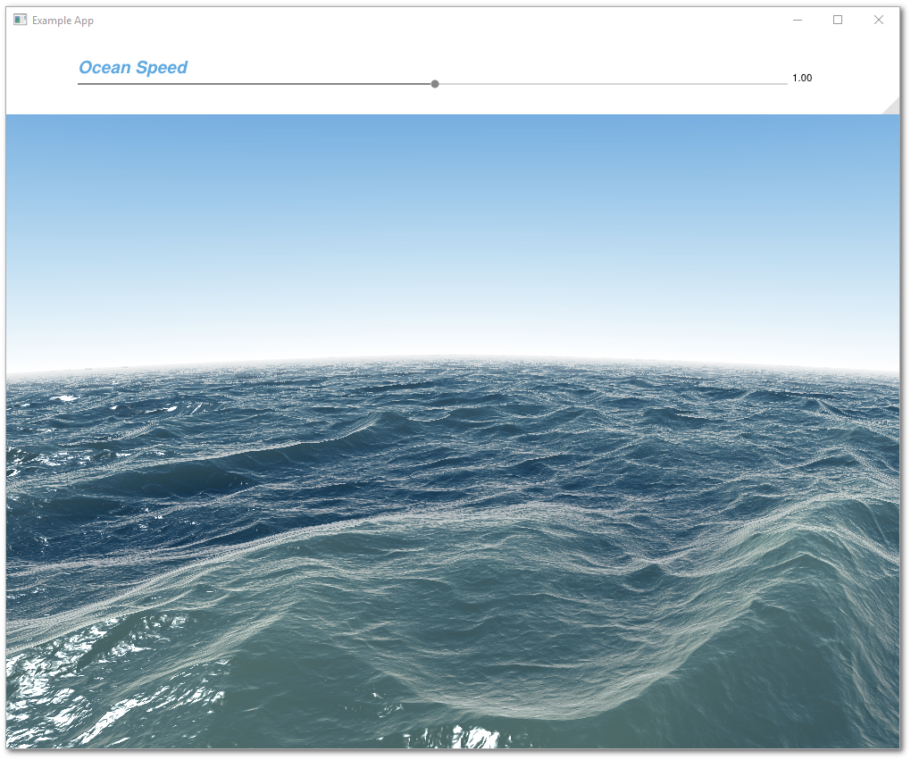
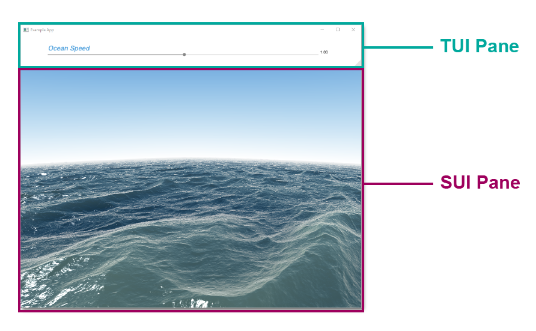

# **Ocean Example**



## **Outline**

* [Overview](#overview)
* [One SUI Pane and One TUI Panes](#one-sui-pane-and-one-tui-pane)
* [Converting Shadertoy to Vulkan Shaders](#converting-shadertoy-to-vulkan-shaders)
* [Updating AppDataIO](#updating-appdataio)
* [Creating the SUI Pane](#creating-the-sui-pane)
    * [The OceanSUI Class Definition](#the-oceansui-class-definition)
    * [The OceanSUI Constructor](#the-oceansui-constructor)
* [Creating the TUI Pane](#creating-the-tui-pane)
    * [The OceanSUI Class Definition](#the-oceansui-class-definition)
    * [The OceanSUI Constructor](#the-oceansui-constructor)
    * [Adding UI Elements](#adding-ui-elements)
* [Adding the Include Statement](#adding-the-include-statement)
* [Adding the Layout](#adding-the-layout)
* [Set the Current Layout Displayed to the Ocean Example](#set-the-current-layout-displayed-to-the-ocean-example)
* [Update CMakeLists](#update-cmakelists)

## **Overview**

This is an example for integrating a shader from [Shadertoy](https://www.shadertoy.comp) with a push constant. This example uses the shader code from [Seascape](https://www.shadertoy.com/view/Ms2SD1) created by [TDM](https://www.shadertoy.com/user/TDM).

Files for the Ocean Example are located in [~/Tutorials/T02_Ocean](../Tutorials/T02_Ocean). There are 6 files needed for this example:

* [ocean.vert](../Tutorials/T02_Ocean/ocean.vert)
* [ocean.frag](../Tutorials/T02_Ocean/ocean.frag)
* [SUI_Demo_Ocean.h](../Tutorials/T02_Ocean/SUI_Demo_Ocean.h)
* [SUI_Demo_Ocean.cpp](../Tutorials/T02_Ocean/SUI_Demo_Ocean.cpp)
* [TUI_Demo_Ocean.h](../Tutorials/T02_Ocean/TUI_Demo_Ocean.h)
* [TUI_Demo_Ocean.cpp](../Tutorials/T02_Ocean/TUI_Demo_Ocean.cpp)

For the most part, the code is already integrated into the GUI Script framework. All that you need to do, is uncomment out a few lines. Here's a walkthrough of how to do it.

## **One SUI Pane and One TUI Pane**

This examples contains two panes. The slider bar at the top is a TUI Pane, while the ocean below is a SUI Pane.



TUI and SUI are different Vulkan pipelines. TUI Panes are processed by `TUI_PipelineBase` class, which is a Vulkan pipeline that processes the triangles generated by the `UILib` draw library and functions.

On the other hand, each SUI Pane is its own unique Vulkan pipeline. All SUI Panes must inherit from the `SUI_PipelineBase` class, which does all the necessary Vulkan pipeline setup for you. 

Check out the [Code Overview Diagram](./Code_Big_Picture_Diagram.pdf) for more details on how the framework is wired, and check out [SUI vs TUI - Details &  Differences](./Tutorials_SUIvsTUI.md) for details on how SUI and TUI work.

## **Converting Shadertoy to Vulkan Shaders**

The Vulkan pipeline for SUI Panes requires two shaders: a vertex shader and a fragment shader. These are already in the tutorial folder.

**Vertex Shader**

A template vertex shader is located in [~/Shaders/shader.vert](../Shaders/shader.vert). We copied this template for our vertex shader [ocean.vert](../Tutorials/T02_Ocean/ocean.vert). Unless you need to pass additional per vertex data, you can just use the template vertex shader.

**Fragment Shader**

Many Shadertoy examples are basically fragment shaders. To make it work with Vulkan, we needed to make a few syntax tweaks and modify the inputs at the top of the file.

The Shadertoy used for this example is located here: https://www.shadertoy.com/view/Ms2SD1

We copied the code from the **Image** tab into our fragment shader [ocean.frag](../Tutorials/T02_Ocean/ocean.frag).

These are the modifications we made to the original Shadertoy code:

* In Shadertoy, the `mainImage()` function in to generate the procedural images by computing a color for each pixel. Vulkan fragment shaders use `main()` instead. 

    ```glsl
    //void mainImage( out vec4 fragColor, in vec2 fragCoord ) {
    void main() {
    ```

* This particular Shadertoy example, we added a factor for rotation speed, that is hooked up to the slider bar. This comes in as a push constant into the fragment shader.

    ```glsl
    //float time = iTime * 0.3 + iMouse.x*0.01;
    float time = PushConstant.SpeedScale * iTime * 0.3 + iMouse.x*0.01;
    ```

* The Shadertoy code requires a number of inputs, which we added at the top of the file. This fragment shader is passed 2 user data inputs:
    * the UBO (uniform buffer object)
    * the push constant

    ```glsl
    layout(set=0, binding=0) uniform u_UniformBuffer {
        float uTime;
        float mouseX;
        float mouseY;
        float mDown;
        vec4 color;
        vec4 dim;
    } ubo;

    layout( push_constant ) uniform Scaling {
        float SpeedScale;
    } PushConstant;

    layout(location = 0) in vec3 i_FragColor;
    layout(location = 1) in vec2 i_TexCoord;

    layout(location = 0) out vec4 fragColor;

    // standard variables put in Layout Pane space - ubo.dim [x,y,width,height]
    float iTime = ubo.uTime;
    vec2 iResolution = vec2( ubo.dim[2], ubo.dim[3]);
    vec2 fragCoord = vec2(gl_FragCoord.x - ubo.dim[0], iResolution.y - gl_FragCoord.y + ubo.dim[1]); // ShaderToy OGL ES is y inverted for Vulkan

    // for this tutorial mute out the mouse motion - just to simplify things
    // if you want to see the mouse motion drive movement, switch the comment in the iMouse definition below
    //vec2 iMouse = vec2(ubo.mouseX - ubo.dim[0], ubo.mouseY - ubo.dim[1]);  // mouse cord in pane (not window) 
    vec2 iMouse = vec2(0,0);
    ```

## **Updating AppDataIO**

The `AppDataIO` is a class that globally shares data and events across the application. It's the best way to pass data between SUI and TUI Panes (in this case, the shader and the slider). Both the ocean fragment shader (SUI) and the slider bar (TUI) need to access the rotation speed. 

The `AppDataIO` class is defined in [~/Include/User/user_AppDataIO.h](../Include/User/user_AppDataIO.h). There is one instance of `AppDataIO` that is created in [main.cpp](../main.cpp), and it is passed to every SUI and TUI object. 

Here, we've put the variable, `OceanSpeed` into the `AppDataIO` class definition.

```cpp
// Ocean Demo
float                   OceanSpeed = 1.0f;
```

The handle to the `AppDataIO` object is found in all SUI and TUI Panes, and is referenced by the variable `AppData`.

## **Creating the SUI Pane**

### The OceanSUI Class Definition

SUI Panes must inherit from the `SUI_PipelineBase` class. In [SUI_Demo_Ocean.h](../Tutorials/T02_Ocean/SUI_Demo_Ocean.h), the class definition for `OceanSUI` inherits from `SUI_PipelineBase`:

```cpp
// ************************************************************ //
// OceanSUI Class                                               //
//                                                              //
// SUI Pipeline for Ocean Demo                                  //
// ************************************************************ //
class OceanSUI : virtual public SUI_PipelineBase {

public:
    
    OceanSUI( PipelineManager &parent );
    virtual ~OceanSUI();

};
```

### The OceanSUI Constructor

Our constructor definition is found in [SUI_Demo_Ocean.cpp](../Tutorials/T02_Ocean/SUI_Demo_Ocean.cpp). 

In this constructor:
* We specify the paths to the compiled shader files.
* We also want to pass in a push constant. This is done by filling `PushConstants`, a vector of float pointers.

```cpp
OceanSUI::OceanSUI( PipelineManager &parent ) :
    SUI_PipelineBase( parent ) {
    Parameters.shader_vert_path = "Shaders/ocean.vert.spv";
    Parameters.shader_frag_path = "Shaders/ocean.frag.spv";
    PushConstants = { &AppData.OceanSpeed };   // Must be float type
}
```

*Note: If you are building your own SUI Pane, we recommend placing your shader files in the [~/Shaders](../Shaders) folder. [CMakeLists.txt](../CMakeLists.txt) automatically searches for and compiles vertex and fragment shaders found in [~/Shaders](../Shaders). It then copies the compiled shaders into ~/build/Shaders. The executable is generated in the ~/build folder and all paths in the code are relative to the executable.*

When defining SUI Pane class objects, you must make sure:

* the constructor definition takes in the argument `PipelineManager &parent`
* `&parent` is passed to the `SUI_PipelineBase` constructor

This ensures that the SUI Pane can access:

* the necessary Vulkan methods
* the `AppData` variable containing globally shared data 

## **Creating the TUI Pane**

### The OceanTUI Class Definition

TUI Panes must inherit from the `TUI_PaneBase` class. In [TUI_Demo_Ocean.h](../Tutorials/T02_Ocean/TUI_Demo_Ocean.h), note how the `OceanTUI` inherits from `TUI_PaneBase`:

```cpp
// ************************************************************ //
// OceanTUI Class                                               //
//                                                              //
// TUI Pane for Ocean Demo                                      //
// ************************************************************ //
class OceanTUI : virtual public TUI_PaneBase {

public:

    OceanTUI( AppDataIO & inAppData );
    ~OceanTUI();
    
    void                DrawPane() override final;
    
private:

    void                InitDraw();
    void                DrawUI();

};
```

### The OceanTUI Constructor

When defining TUI Pane class objects, you must make sure:

* the constructor definition takes in the argument `AppDataIO & inAppData`
* `&inAppData` is passed to the `TUI_PaneBase` constructor

This ensures that the TUI Pane can access the `AppData` variable, which contains the globally shared data.

```cpp
OceanTUI::OceanTUI( AppDataIO & inAppData ) :
    TUI_PaneBase( inAppData ) {
}
```

### Adding UI Elements

The `OceanTUI` class also overrides the `DrawPanes()` method from `TUI_PaneBase`. When Vulkan processes the TUI pipeline, it calls the `DrawPanes()` method for every TUI Pane described in the active layout. Currently, `UILib` layers high level drawing functions over low-level `ImGui` components, so the drawing code will include methods both under the `UILib` namespace and the `ImGui` namespace. `UILib` drawing methods are always prefixed by `UI` to disambiguate between the two libraries.

```cpp
void OceanTUI::DrawPane() {
    
    StartPane();
    ImGuiIO& io = ImGui::GetIO();
    ImGui::SetNextWindowPos( ImVec2(X,Y) );
    ImGui::SetNextWindowSize( ImVec2( Width, Height ) );

    static bool initialized;
    if (!initialized) {InitDraw(); initialized = true;}
    
    ImGui::Begin( "Ocean UI", NULL, ImGuiWindowFlags_NoTitleBar | ImGuiWindowFlags_NoScrollbar);
    
    DrawUI();
    ImGui::End();
    FinishPane();

}
```

You can use this definition of `DrawPane()` as a template. At minimum, the definition of `DrawPane()` must have the following:

1. **Initialize the UI**:

    * Call `StartPane()`

    * Set pane position and size:

        ```cpp
        ImGui::SetNextWindowPos( ImVec2(X,Y) );
        ImGui::SetNextWindowSize( ImVec2( Width, Height ) );
        ```

        *Note: Every class object derived from `TUI_PaneBase` has `X`, `Y`, `Width`, and `Height`. These variables are updated by the `LayoutManager`, which figures out the position and size based on the layout definition you give it. We will go through how to add a layout in the following sections.*

    * Call any initialization code that needs to be run only once:

        ```cpp
        static bool initialized;
        if (!initialized) {InitDraw(); initialized = true;}
        ```

        Currently, `InitDraw()` is left blank and left as a place holder where you can add initialization code that you only need to call once.

        ```cpp
        void OceanTUI::InitDraw(){
            // add draw intialization code you only call once here
        }
        ```

    * Call `ImGui::Begin`:
    
        ```cpp
        ImGui::Begin( "Ocean UI", NULL, ImGuiWindowFlags_NoTitleBar | ImGuiWindowFlags_NoScrollbar);
        ```

        This associates the pane with the string identifier `Ocean UI`, and also passes in flags to specify that there is no title bar and no scroll bar.

2. **Draw the UI**

    * This is done by calling the private helper method `DrawUI()` which contains the `UILib` components needed for the pane (i.e., buttons, slider bars, etc.).
    
        ```cpp
        DrawUI();
        ```

        `DrawUI()` contains the code for generating the slider. Note that we pass a reference variable, `&AppData.OceanSpeed` into `UIAddSliderH` and `UIAddTextFloat`. This allows the slider UI to access the global data variable `AppData.OceanSpeed`. 

        ```cpp
        void OceanTUI::DrawUI(){
            
            float yVal = 50;
            float textWidth = 40;
            float SideOffset = 100.0;
            float SliderWidth = Width - SideOffset * 2;
            float SliderHeight = 12.0f;
            float SliderX = SideOffset - textWidth * 0.5f;
            UIAddSliderH(SliderX, yVal, SliderWidth, SliderHeight, &AppData.OceanSpeed, 0.0f, 2.0f);
            UIAddTextFloat( SliderX  + SliderWidth, yVal - 9, textWidth, 30, &AppData.OceanSpeed, vec2(0,0));
            UIAddTextWithFont(SliderX,15,130, 44, "Ocean Speed", 0x5FA9E0, 3, vec2(0,.5));
            
        }
        ```

        For a quick overview of UILib functions, take a look [here.](UILib_Starting_Functions.md)

3. **Finish Drawing**

    * Call `ImGui::End()` and `FinishPane()`


## **Adding the Include Statement**

All `#include` statements for SUI and TUI panes must be added to the [~/Include/User/user_Includes.h](../Include/User/user_Includes.h) file.

Make sure you uncomment these lines:

```cpp
#include "SUI_Demo_Ocean.h"
#include "TUI_Demo_Ocean.h"
```

## **Adding the Layout**

All layouts for SUI and TUI panes must be specified in the [~/Include/User/user_Layouts.cpp](../Include/User/user_Layouts.cpp) file.

In the definition for `LayoutManager::InitLayouts()`, you need to initialize the `OceanSUI` and `OceanTUI` pane objects.

To do that, make sure you uncomment these lines:

```cpp
PTM.AddSUI<OceanSUI> ( "OceanShader" );
PTM.AddTUI<OceanTUI> ( "OceanSlider" );
```

Next, we need to specify how we want these two panes are to be positioned in the window and relative to each other. Find the **Ocean Example** layout and uncomment it:

```cpp
// =============PaneTreeName====LazyUpdate===Name=============ParentName======WidthExp=====HeightExp===Split=======Mode====FloatX==FloatY=== 
PTM.AddPaneTree( "Ocean Example",  1,    {  {"Main",            "",              "*",        "*",        "y",        "",     "",     ""     },
                                            {"OceanSlider",     "Main",          "",         "90",       "",        "",     "",     ""     },
                                            {"OceanShader",     "Main",          "*",        "*",        "",        "",     "",     ""     }
});
```

For a review of to arrange panes in layouts, take a look at the [Layout Tutorial.](../Tutorials/Tutorials_Layout.md).

## **Set the Current Layout Displayed to the Ocean Example**

At the bottom of the `LayoutManager::InitLayouts()` definition, make sure you change the current layout to **Ocean Example**:

```cpp
SetCurrentLayout( "Ocean Example" ); 
```

## **Update CMakeLists**

Finally, before we compile, we need to tell [CMakeLists.txt](../CMakeLists.txt) to link the tutorial files to the main application. Update the `TUTORIAL_LIST` CMake variable to include the Ocean Example folder:

```cmake
set(TUTORIAL_LIST
	"Tutorials/T02_Ocean"
)
```

## **That's it, just compile and run!**


