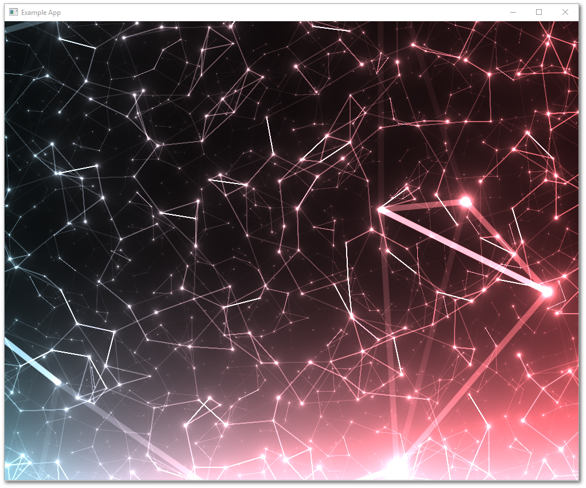

# **Particles Example**



## **Outline**

* [Overview](#overview)
* [One SUI Pane and No TUI Panes](#one-sui-pane-and-no-tui-panes)
* [Converting Shadertoy to Vulkan Shaders](#converting-shadertoy-to-vulkan-shaders)
* [Creating the SUI Pane](#creating-the-sui-pane)
    * [The ParticlesSUI Class Definition](#the-particlessui-class-definition)
    * [The ParticlesSUI Constructor](#the-particlessui-constructor)
* [Adding the Include Statement](#adding-the-include-statement)
* [Adding the Layout](#adding-the-layout)
* [Set the Current Layout Displayed to the Particles Example](#set-the-current-layout-displayed-to-the-particles-example)
* [Update CMakeLists](#update-cmakelists)

## **Overview** 

This is a simple example for integrating a shader from [Shadertoy](https://www.shadertoy.comp). This example uses the shader code from [Plexus Particles](https://www.shadertoy.com/view/lldyDs) created by [eclmist](https://www.shadertoy.com/user/eclmist).

Files for the Particle Example are located in [~/Tutorials/T01_Particles](../Tutorials/T01_Particles). There are 4 files needed for this example:

* [particles.vert](../Tutorials/T01_Particles/particles.vert)
* [particles.frag](../Tutorials/T01_Particles/particles.frag)
* [SUI_Demo_Particles.h](../Tutorials/T01_Particles/SUI_Demo_Particles.h)
* [SUI_Demo_Particles.cpp](../Tutorials/T01_Particles/SUI_Demo_Particles.cpp)

For the most part, the code is already integrated into the GUI Script framework. All that you need to do, is uncomment out a few lines. Here's a walkthrough of how to do it.

## **One SUI Pane and No TUI Panes**

This example does not use any TUI function calls. There are no TUI Panes presented to the screen. All of the drawing code is in the fragment shader, so this is simply one SUI Pane.

To recap, SUI Panes are unique Vulkan pipelines. All SUI Panes must inherit from the `SUI_PipelineBase` class, which does all the necessary Vulkan pipeline setup for you. For more details on how the framework is wired, check out the [Code Overview Diagram](./Code_Big_Picture_Diagram.pdf).

## **Converting Shadertoy to Vulkan Shaders**

The Vulkan pipeline for SUI Panes requires two shaders: a vertex shader and a fragment shader. These are already in the tutorial folder.

**Vertex Shader**

A template vertex shader is located in [~/Shaders/shader.vert](../Shaders/shader.vert). We copied this template for our vertex shader [particles.vert](../Tutorials/T01_Particles/particles.vert). Unless you need to pass additional per vertex data, you can just use the template vertex shader.

**Fragment Shader**

Many Shadertoy examples are basically fragment shaders. To make it work with Vulkan, we needed to make a few syntax tweaks and modify the inputs at the top of the file.

The Shadertoy used for this example is located here: https://www.shadertoy.com/view/lldyDs

We copied the code from the **Image** tab into our fragment shader [particles.frag](../Tutorials/T01_Particles/particles.frag).

These are the modifications we made to the original Shadertoy code:

* In Shadertoy, the `mainImage()` function in to generate the procedural images by computing a color for each pixel. Vulkan fragment shaders use `main()` instead. 

   ```glsl
   //void mainImage( out vec4 fragColor, in vec2 fragCoord )
    void main()
    ```

* This particular Shadertoy example takes an input `iChannel0`, which is a sound file. We ignored this to keep the example simple.

    ```glsl
    //float fft = texelFetch(iChannel0, ivec2(76.0, 0.), 0).x / 2.0 + 0.5;
    float fft = 1.0f;
    ```

* The Shadertoy code requires a number of inputs, which we added at the top of the file.

    ```glsl
    layout(set=0, binding=0) uniform u_UniformBuffer {
        float uTime;
        float mouseX;
        float mouseY;
        float mDown;
        vec4 color;
        vec4 dim;
    } ubo;


    layout(location = 0) in vec3 i_FragColor;
    layout(location = 1) in vec2 i_TexCoord;

    layout(location = 0) out vec4 fragColor;

    // standard variables put in Layout Pane space - ubo.dim [x,y,width,height]
    float iTime = ubo.uTime;
    vec2 iResolution = vec2( ubo.dim[2], ubo.dim[3]);
    vec2 iMouse = vec2(ubo.mouseX - ubo.dim[0], ubo.mouseY - ubo.dim[1]);  // mouse cord in pane (not window) 
    vec2 fragCoord = vec2(gl_FragCoord.x - ubo.dim[0], iResolution.y - gl_FragCoord.y + ubo.dim[1]); // ShaderToy OGL ES is y inverted for Vulkan
    ```

## **Creating the SUI Pane**

### The ParticlesSUI Class Definition

SUI Panes must inherit from the `SUI_PipelineBase` class. In [SUI_Demo_Particles.h](../Tutorials/T01_Particles/SUI_Demo_Particles.h), the class definition for `ParticlesSUI` inherits from `SUI_PipelineBase`:

```cpp
// ************************************************************ //
// ParticlesSUI Class                                           //
// ************************************************************ //
class ParticlesSUI : virtual public SUI_PipelineBase {

public:

    ParticlesSUI( PipelineManager &parent );
    virtual ~ParticlesSUI();

};
```

### The ParticlesSUI Constructor

Our constructor definition is found in [SUI_Demo_Particles.cpp](../Tutorials/T01_Particles/SUI_Demo_Particles.cpp). In this constructor, we specify the paths to the compiled shader files. Since we do not need any textures or additional UBO inputs, there is no need for us to specify anything else.

```cpp
ParticlesSUI::ParticlesSUI( PipelineManager &parent ) :
    SUI_PipelineBase( parent ) {
    Parameters.shader_vert_path = "Shaders/particles.vert.spv";
    Parameters.shader_frag_path = "Shaders/particles.frag.spv";
}
```

*Note: If you are building your own SUI Pane, we recommend placing your shader files in the [~/Shaders](../Shaders) folder. [CMakeLists.txt](../CMakeLists.txt) automatically searches for and compiles vertex and fragment shaders found in [~/Shaders](../Shaders). It then copies the compiled shaders into ~/build/Shaders. The executable is generated in the ~/build folder and all paths in the code are relative to the executable.*

When defining SUI Pane class objects, you must make sure:

* the constructor definition takes in the argument `PipelineManager &parent`
* `&parent` is passed to the `SUI_PipelineBase` constructor

This ensures that the SUI Pane can access:

* the necessary Vulkan methods
* the `AppData` variable containing globally shared data 

## **Adding the Include Statement**

All `#include` statements for SUI and TUI panes must be added to the [~/Include/User/user_Includes.h](../Include/User/user_Includes.h) file.

Make sure you uncomment this line:

```cpp
#include "SUI_Demo_Particles.h"
```

## **Adding the Layout**

All layouts for SUI and TUI panes must be specified in the [~/Include/User/user_Layouts.cpp](../Include/User/user_Layouts.cpp) file.

In the definition for `LayoutManager::InitLayouts()`, you need to initialize the `ParticlesSUI` object.

To do that, make sure you uncomment this line:

```cpp
PTM.AddSUI<ParticlesSUI> ( "ParticlesShader" );
```
Next, we need to specify how we want this SUI Pane to be positioned in the window. Find the **Particles Example** layout and uncomment it:

```cpp
// =============PaneTreeName====LazyUpdate===Name=============ParentName======WidthExp=====HeightExp===Split=======Mode====FloatX==FloatY=== 
PTM.AddPaneTree( "Particles Example", 1,{   {"Main",            "",              "*",        "*",        "y",        "",     "",     ""     },
                                            {"ParticlesShader", "Main",          "*",        "*",        "y",        "",     "",     ""     }
});

```

For a review of to arrange panes in layouts, take a look at the [Layout Tutorial.](../Tutorials/Tutorials_Layout.md).

In this example, we only have 1 pane, so we fill the entire window.


## **Set the Current Layout Displayed to the Particles Example**

At the bottom of the `LayoutManager::InitLayouts()` definition, make sure you change the current layout to **Particles Example**:

```cpp
SetCurrentLayout( "Particles Example" ); 
```

## **Update CMakeLists**

Finally, before we compile, we need to tell [CMakeLists.txt](../CMakeLists.txt) to link the tutorial files to the main application. Update the `TUTORIAL_LIST` CMake variable to include the Particles Example folder:

```cmake
set(TUTORIAL_LIST
	"Tutorials/T01_Particles"
)
```

## **That's it, just compile and run!**